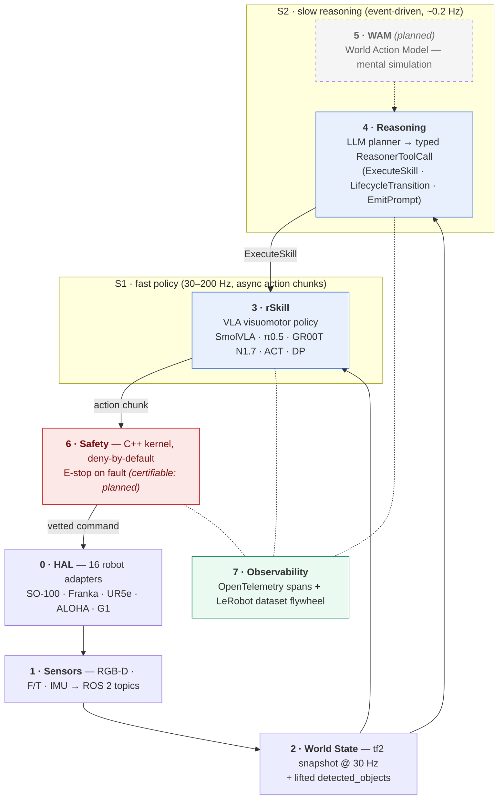

<div align="center">


# OpenRAL

**An open-source operating layer for embodied AI**, OpenRAL unifies fast policies, slow reasoning, perception AI and classical control into one typed, traceable, safety-first runtime for deployable robot agents.

[](https://github.com/OpenRAL/openral/actions)
[](https://docs.ros.org/en/jazzy/)
[](LICENSE)
[](pyproject.toml)
[](https://openral.github.io/openral/)
[](https://huggingface.co/OpenRAL)
[](https://discord.gg/3paXT2bVyB)

[Quick start](#quick-start) · [Architecture](#architecture) · [Robots](docs/reference/robots.md) · [rSkills](docs/reference/rskills.md) · [Reasoner](docs/reference/reasoner.md) · [Sim envs](docs/reference/sim-environments.md) · [Discord](https://discord.gg/3paXT2bVyB) · [Docs](https://openral.github.io/openral/)

</div>

<div align="center">

### See it run


<sub>A randomized grid of real eval runs — benchmarks, simulation, and on-hardware deployment. Watch the full scored showcase (SUCCESS / FAIL, per rSkill) at <a href="https://openral.com/#showcase">openral.com</a>.</sub>

</div>

---

## What is OpenRAL?

OpenRAL is a typed, layered runtime that sits between a robot's motor API and a task planner. It is four things in one:

- **Typed runtime** — eight well-defined layers (HAL → Sensors → World State → rSkill → Reasoning → WAM → Safety → Observability) with Pydantic v2 contracts at every boundary.
- **rSkill packaging format** — HuggingFace Hub artifacts containing weights, a `rskill.yaml` manifest, quantisation hints, latency budgets, and reproducible eval. Install like a model: `openral rskill install OpenRAL/rskill-smolvla-libero`.
- **Planning kernel** — a slow, provider-agnostic LLM reasoner (S2) emitting typed `ReasonerToolCall` tool-calls (`ExecuteRskillTool`, `LifecycleTransition`, `EmitPrompt`, plus read-only `locate_in_view` / `query_scene` / `query_task_progress` / `recall_object` query tools), and a fast visuomotor policy (S1, 30–200 Hz) executing dispatched skills. Replanning is bounded and explicit. See the **[Reasoner reference](docs/reference/reasoner.md)**.
- **Safety kernel** — a C++ separate process, deny-by-default. An allocation-free validator enforces joint position / velocity / torque limits, a global torque cap, Cartesian workspace and end-effector-speed limits, NaN/Inf rejection, and self / world / voxel-grid collision — backed by independent deadman and hardware-E-stop watchdog processes. Python proposes actions; C++ disposes them; `ROSSafetyViolation` is never silently caught. Formal certification is the remaining work.

We compose ROS 2, tf2, MoveIt 2 (with optional CUDA-accelerated **cuMotion** planning), Nav2, NVIDIA Isaac ROS (**cuVSLAM + nvblox** vision SLAM), and `ros2_control` — we don't reinvent them.

**Shipped today** (all workspace packages at `0.1.0`):
- `openral_core` schemas + the `openral` CLI (bare `openral` drops into a REPL)
- HAL adapters for [16 robot platforms](docs/reference/robots.md) — manipulators, bimanual arms, humanoids
- [Sensor catalog](docs/reference/sensors_landscape.md) — RGB-D, F/T, and USB-UVC adapters
- `WorldStateAggregator` — 30 Hz tf2-aware snapshot with lifted object detections
- [rSkill packages](docs/reference/rskills.md) spanning every kind — VLA policies (SmolVLA, π0.5, xVLA, MolmoAct2, ACT, Diffusion Policy, 3D Diffuser Actor, RLDX-1, OpenVLA-OFT, GR00T N1.7), open-vocabulary detectors (RT-DETR, OmDet-Turbo, LocateAnything), the Qwen3.5-4B scene VLM (`kind: vlm`), the Robometer-4B reward/progress monitor (`kind: reward`), MoveIt / Nav2 classical-control skills (`kind: ros_action`), and human-authored reasoner playbooks (`kind: playbook`)
- [`openral sim run`](docs/reference/sim-environments.md) — YAML-driven rollouts across [the benchmark scene catalogue](docs/reference/sim-environments.md) (LIBERO, MetaWorld, ManiSkill3, SimplerEnv, RoboCasa, RoboTwin 2.0, gym-aloha, gym-pusht, Isaac Sim, RLBench/CoppeliaSim)
- **Object detection & spatial lift** — promptable open-vocabulary detectors (OmDet-Turbo default, RT-DETR fallback) → `ObjectsMetadata`, lifted 2D→3D into world state; on-demand `locate_in_view` for novel targets
- **Navigation & SLAM** — `openral_slam_bringup` + `openral_nav2_bringup` as reasoner-managed services: `slam_toolbox` for lidar robots, or **NVIDIA Isaac ROS cuVSLAM + nvblox** (fed by a **Depth Anything 3** monocular metric-depth provider) for lidar-less robots → `map` frame + Nav2 path planning
- **GPU-accelerated MoveIt planning** — `cuMotion` CUDA pipeline behind a capability gate, OMPL fallback (ADR-0065)
- **TensorRT runtime** — `TensorRTRuntime` + engine cache, plus a GStreamer/NVMM zero-copy detector path for accelerated on-device inference
- C++ **safety kernel** — deny-by-default allocation-free validator (envelope + self/world/voxel collision) + independent deadman & hardware-E-stop watchdogs
- ADR-0018 [reasoner](docs/reference/reasoner.md)/safety ROS graph with provider-agnostic LLM tool dispatch
- OpenTelemetry instrumentation with OTLP export, live `openral dashboard`, and a read-only **Foxglove** live-scene surface

Live status: [docs/roadmap/index.md](docs/roadmap/index.md). Per-module canvas: [docs/architecture/repo-state-map.html](docs/architecture/repo-state-map.html).

---

## Features at a glance

| Capability | What you get | Where it lives |
|---|---|---|
| Typed robot manifests | `RobotDescription` (Pydantic v2): joints, links, sensors, embodiment tags, capabilities | `python/core/`, fixtures in `robots/` |
| HAL adapters | Uniform `HAL` Protocol — `connect / read_state / send_action / estop / disconnect`; per-robot lifecycle nodes | `python/hal/`, `packages/openral_hal_*/` |
| Sensor catalog | Typed `SensorSpec` / `SensorBundle` for cameras, depth, IMU, F/T, tactile, lidar | `python/sensors/` |
| World state | 30 Hz tf2-aware snapshot with staleness latching; carries lifted `detected_objects`; consumed by S1 and S2 | `python/world_state/`, `packages/world_state/` |
| Object detection | Promptable open-vocabulary `kind: detector` rSkills (OmDet-Turbo default, RT-DETR fallback, LocateAnything-3B) → `ObjectsMetadata`, lifted 2D→3D into world state; on-demand `locate_in_view` for novel targets | `packages/openral_perception_ros/`, ADR-0035/0037/0051/0056 |
| Scene understanding (S2) | `kind: vlm` rSkill (Qwen3.5-4B NF4) → the reasoner's read-only `query_scene` tool for task-progress / success verification ("did the grasp succeed?") | `packages/openral_perception_ros/` (`scene_vlm_node`), ADR-0047 |
| Task-progress monitor (S2) | `kind: reward` rSkill (Robometer-4B NF4) runs parallel to the VLA → read-only `query_task_progress` tool emitting per-frame progress + success scalars to gate replanning | `packages/openral_perception_ros/` (`reward_monitor_node`), ADR-0057 |
| Reasoner (S2) | Event-driven, provider-agnostic LLM planner emitting typed `ReasonerToolCall` tool-calls; closed, capability-gated tool palette; bounded replanning | `python/reasoner/`, `packages/openral_reasoner_ros/`, [docs](docs/reference/reasoner.md) |
| Navigation & SLAM | Reasoner-managed `slam_toolbox` (lidar) or Isaac ROS cuVSLAM + nvblox + Depth-Anything-3 mono-depth (lidar-less) → `map` frame; Nav2 path planning | `packages/openral_slam_bringup/`, `packages/openral_nav2_bringup/`, ADR-0025/0064 |
| GPU-accelerated planning | `cuMotion` CUDA-accelerated MoveIt pipeline behind `RobotCapabilities.supports_cumotion()`, OMPL fallback | `packages/openral_safety/` (`cumotion_config.py`), ADR-0065 |
| Safety kernel | C++ deny-by-default validator — joint position/velocity/torque + global cap, Cartesian workspace + EE-speed, NaN/Inf, self/world/voxel collision; deadman + hardware E-stop watchdogs | `cpp/openral_safety_kernel/`, `packages/openral_safety/`, ADR-0020/0030/0040 |
| rSkill (S1) runtime | `Skill` ABC, `rSkill` loader (HF Hub), PyTorch / ONNX / **TensorRT** adapters (engine cache), async action chunks | `python/rskill/`, `rskills/` |
| Inference runtimes | One `InferenceRunner` Protocol shared by `openral sim run`, `openral benchmark run`, and `openral deploy`; `TensorRTRuntime` + GStreamer/NVMM zero-copy detector path for accelerated on-device inference | `python/runner/`, `python/rskill/`, `python/sim/` |
| Sim rollouts | One YAML → reproducible sim rollout; video + metrics + `SkillEvalResult` JSON out | `python/sim/`, `scenes/benchmark/` |
| Simulation engines | MuJoCo (LIBERO, MetaWorld, ManiSkill3, SimplerEnv, gym-aloha, gym-pusht), RoboCasa, RoboTwin 2.0 (SAPIEN), Isaac Sim, RLBench/CoppeliaSim (PyRep, py3.10 sidecar) | `python/sim/`, `docs/reference/sim-environments.md` |
| Observability | OpenTelemetry SDK + OTLP exporter, span helpers, structlog bridge, live `openral dashboard`, read-only Foxglove live-scene surface | `python/observability/`, ADR-0059 |
| CLI (`openral`) | `doctor`, `detect`, `connect`, `calibrate`, `check`, `install`, `rskill`, `sensor`, `sim`, `benchmark`, `deploy`, `dashboard`, `prompt`, `record`, `replay`, `dataset`, `collision`, `robot`, `profile`. Bare `openral` → interactive REPL. | `python/cli/` |
| Schemas | Pydantic v2 + JSON Schema export; manifests at `schema_version: "0.2"` (ADR-0069) | `python/core/`, `tools/schema_export.py` |
| ROS 2 IDL | `openral_msgs` (.msg, .action) — normative across the runtime | `packages/msgs/` |

## Supported platforms

OpenRAL ships an **x86 inference Dockerfile** today; a Jetson / L4T family is planned ([ADR-0016](docs/adr/0016-multi-platform-support.md)):

| Image | Target | Notes |
|---|---|---|
| `docker/inference/Dockerfile.x86` | x86_64 + NVIDIA dGPU (Turing–Blackwell) | Default build. `Platform=NVIDIA_DESKTOP`. |
| `docker/inference/Dockerfile.x86` (`WITH_CUDA=0`) | x86_64 CPU-only | `Platform=CPU_ONLY`. |
| `Dockerfile.l4t` *(planned)* | Jetson Orin AGX / Orin NX / Orin Nano | `Platform=TEGRA`; full NVMM zero-copy. |
| `Dockerfile.l4t` *(planned, degraded)* | Jetson Xavier / Xavier NX | CC 7.2 → FP16/INT8 only. |
| `Dockerfile.l4t` *(planned, best-effort)* | Maxwell Nano (legacy) | No CI signal. |

`openral doctor` prints which of `x86-cuda` / `x86-cpu` / `l4t-orin` / `l4t-xavier` / `l4t-nano-maxwell` / `unsupported` the host matches. Apple Silicon is a development affordance only — no deploy image.

---

## Quick start

One-liner install (no clone, no sudo):

```bash
curl -fsSL https://raw.githubusercontent.com/OpenRAL/openral/master/scripts/install.sh | bash
openral doctor                  # verify environment
openral install sim             # opt-in: CPU sim physics
openral install ros             # opt-in: ROS 2 + apt (needs sudo)
```

Heavy extras (LIBERO, RoboCasa, MetaWorld, ManiSkill3, SimplerEnv, ROS 2) are installed on demand via `openral install <group>` or automatically on first `openral sim run` against a scene that needs them. See `openral install list` for the full menu.

> **Pre-PyPI gap.** `openral-cli` is not yet on PyPI. Until then:
> ```bash
> curl -fsSL https://raw.githubusercontent.com/OpenRAL/openral/master/scripts/install.sh \
>   | OPENRAL_INSTALL_SOURCE=git+https://github.com/OpenRAL/openral bash
> ```
> See [ADR-0021](docs/adr/0021-curl-installer-cli-rename-and-pypi-release.md).

For contributors (full clone + ROS 2 + `colcon`):

```bash
git clone https://github.com/OpenRAL/openral && cd openral
just quickstart         # bootstrap → uv sync → ros2-build → openral REPL
```

Or step-by-step:

```bash
just bootstrap                  # uv + ROS 2 Jazzy + system deps
just sync                       # resolve & install workspace (always `just sync`, never bare `uv sync`)
just ros2-build                 # colcon build
source install/setup.bash
uv run openral doctor
```

> Sim / VLA work needs an opt-in dependency group: `just sync --group sim`
> (or `--group libero` / `--group robocasa` / `--group metaworld` / `--group
> maniskill3`). See [Managing the Python environment & dependency
> groups](docs/contributing/toolchain.md#managing-the-python-environment-dependency-groups)
> — including the LIBERO ↔ RoboCasa group-swap and the RoboCasa runtime
> auto-install.

The `openral` CLI lives in `.venv/bin/openral`. Run via `uv run openral ...` or `source .venv/bin/activate`. For a global install: `uv tool install --editable python/cli`.

`uv run openral doctor` output on a working machine:

```
         openral doctor
┏━━━━━━━━━━━━━━━━━━━━┳━━━━━━━━━┳━━━━━━━━━━━━━━━━━━━━━━━━━━━━━━━━┓
┃ check              ┃ status  ┃ details                        ┃
┡━━━━━━━━━━━━━━━━━━━━╇━━━━━━━━━╇━━━━━━━━━━━━━━━━━━━━━━━━━━━━━━━━┩
│ Python             │ ok      │ 3.12.9                         │
│ Platform           │ info    │ Linux 6.14.0                   │
│ openral-core       │ ok      │ 0.1.0                          │
│ ROS 2 binary       │ ok      │ /opt/ros/jazzy/bin/ros2        │
│ ROS 2 distro       │ ok      │ jazzy                          │
│ RMW                │ info    │ rmw_fastrtps_cpp (default)     │
│ colcon             │ ok      │ /usr/bin/colcon                │
│ GPU 0              │ ok      │ NVIDIA RTX 4090 (24576 MiB)    │
│ USB devices        │ info    │ none found                     │
│ just               │ ok      │ /usr/local/bin/just            │
└────────────────────┴─────────┴────────────────────────────────┘
```

---

## Architecture



```
0  HAL              Hardware Abstraction Layer — per-robot adapters (SO-100, G1, UR5e…)
1  Sensors          SensorSpec → ROS 2 topic streams (RGB, depth, IMU, lidar, tactile)
2  World State      tf2-aware typed snapshot at 30 Hz; folds in object detections
3  rSkill (S1)       Fast visuomotor policy (VLA, 30–200 Hz, async action chunks)
4  Reasoning (S2)   Slow LLM planner emitting typed ReasonerToolCall tool-calls
5  WAM              Optional World Action Model for mental simulation (planned)
6  Safety           C++ separate process, deny-by-default, certifiable, E-stop on fault
7  Observability    OpenTelemetry spans + LeRobotDataset v3 flywheel
```

Layer boundaries are enforced by Pydantic v2 schemas in `python/core/`. Crossing a layer without an ADR is rejected in review. Per-module live status: [docs/architecture/repo-state-map.html](docs/architecture/repo-state-map.html). Architecture deep-dive: [docs/architecture/overview.md](docs/architecture/overview.md).

---

## Run commands (cheat sheet)

```bash
# Environment — always `just sync` (never bare `uv sync`); add `--group sim`
# for VLA/sim work. See docs/contributing/toolchain.md.
just bootstrap && just sync
uv run openral doctor

# Discovery
uv run openral detect                        # auto-detect robot + sensors → robot.yaml
uv run openral sensor list                   # browse the sensor catalog
uv run openral rskill search aloha           # discover rSkills on the OpenRAL Hub org
uv run openral rskill list                   # list installed rSkills
uv run openral rskill install OpenRAL/rskill-smolvla-libero
uv run openral benchmark report              # aggregate eval/*.json results

# Simulated rollouts — see docs/reference/sim-environments.md
just sim-libero                              # SmolVLA × LIBERO
just sim-pi05-libero                         # π0.5 × LIBERO (≥8 GB VRAM)
just sim-act-aloha                           # ACT × gym-aloha bimanual

# Observability
uv run openral dashboard                     # OTLP receiver at :4318

# Hardware deployment
uv run openral deploy run --config deployments/<your-deployment>.yaml
uv run openral deploy sim --config scenes/deploy/openarm_tabletop.yaml
just hil so100                               # SO-100 HIL (USB + servos)

# Quality gates
just test && just lint                       # unit suite + ruff + mypy --strict
just test-changed                            # only tests a `git diff` can affect — see docs/contributing/selective-testing.md
just ros2-build && just ros2-test
just schema-export && just docs
```

Full toolchain: [docs/contributing/toolchain.md](docs/contributing/toolchain.md). Test inventory: [tests/README.md](tests/README.md). Selective testing: [docs/contributing/selective-testing.md](docs/contributing/selective-testing.md).

---

## Robot descriptions

16 robot platforms are supported, from low-cost manipulators to bimanual arms and humanoids. Each is a typed `RobotDescription` manifest under `robots/<robot_id>/robot.yaml`.

→ **Full table:** [docs/reference/robots.md](docs/reference/robots.md)

Quick examples: SO-100/SO-101 (HW + sim), Franka Panda, UR5e/UR10e, ALOHA bimanual, OpenArm v2, Unitree H1/G1, Rethink Sawyer, Fourier GR1.

---

## Sensors

The sensor catalog ships typed adapters wrapping vendor SDKs into `SensorSpec` / `SensorBundle` records. Browse with `openral sensor list`; resolve one with `openral sensor show <id>`.

**Shipped:** RealSense D435/D435i/D415, Luxonis OAK-D Pro, USB UVC (generic RGB), Robotiq FT-300.

**Planned:** Orbbec, lidar (Ouster / Livox / Hokuyo / SLAMTEC), standalone IMU, tactile (DIGIT / GelSight).

→ **Full catalog & roadmap:** [docs/reference/sensors_landscape.md](docs/reference/sensors_landscape.md)

---

## Sim environments

Benchmark scenes span LIBERO, MetaWorld (MT10/MT50), ManiSkill3, SimplerEnv, RoboCasa, RoboTwin 2.0 (dual-arm SAPIEN), gym-aloha, gym-pusht, Isaac Sim, and RLBench/CoppeliaSim. Each YAML is a complete `SimEnvironment` — one command to run.

→ **Full config index:** [docs/reference/sim-environments.md](docs/reference/sim-environments.md)

---

## rSkills

rSkills are HuggingFace-Hub-shaped packages — manifest + weights + reproducible `eval/` — installed and run with the `openral rskill` CLI.

rSkills come in several **kinds**, all installed and run the same way:

- **`kind: vla`** — visuomotor policies (S1): SmolVLA, π0.5, xVLA, MolmoAct2, ACT, Diffusion Policy, 3D Diffuser Actor, RLDX-1, OpenVLA-OFT, GR00T N1.7.
- **`kind: detector`** — open-vocabulary object detectors: RT-DETR (COCO ONNX), **OmDet-Turbo** (Apache-2.0 open-vocab, default), and LocateAnything-3B (NF4 VLM). Continuous detectors stream into world state; on-demand ones answer the reasoner's `locate_in_view`.
- **`kind: vlm`** — the Qwen3.5-4B scene VLM (Apache-2.0), drives the read-only `query_scene` tool for success/progress verification.
- **`kind: reward`** — the Robometer-4B progress monitor (Apache-2.0), runs parallel to a VLA and drives `query_task_progress`.
- **`kind: ros_action`** — classical-control skills wrapping MoveIt (`rskill-moveit-joints` / `-eef-pose` / `-look-at`) and Nav2 (`rskill-nav2-navigate-to-pose`).
- **`kind: playbook`** — human-authored Markdown SOPs the S2 reasoner reads as content (decompose-mission, verify-outcome, clarify-ambiguity, preflight-reach, stage-for-manipulation, find-object); no weights, no actuation (ADR-0072).

Most are published under `OpenRAL/rskill-*` on HuggingFace Hub. LocateAnything is private and non-commercial; the GR00T N1.7 policy (`gr00t-n17-libero`, NVIDIA Open Model License) loads upstream `nvidia/GR00T-N1.7-LIBERO` weights via an out-of-process sidecar (ADR-0046). The OpenVLA-OFT policy (`openvla-oft-simpler-widowx-nf4`, MIT) is an in-process transformers custom-code model (NF4, loaded in a dedicated `transformers<5` runtime) that solves the SimplerEnv WidowX carrot-on-plate ManiSkill3 task (ADR-0063, issue #55).

→ **Full table + license notes:** [docs/reference/rskills.md](docs/reference/rskills.md)

```bash
openral rskill install OpenRAL/rskill-smolvla-libero
openral rskill check    # which installed rSkills run on this host?
```

---

## Supported VLAs

See [CLAUDE.md §3](CLAUDE.md) for the full model-by-model license matrix and adapter status. Compatibility matrix (observed obs/action dims, normalisation): [docs/reference/vla_compatibility.md](docs/reference/vla_compatibility.md).

---

## Reasoning (S2)

The **reasoner** is the slow, deliberative half of the dual-system architecture. It is an event-driven LLM supervisor (0.2 Hz heartbeat, preempted by failures and operator prompts) that reads a structured situation report — world state, recent failures, perception events, pending prompts — and emits **exactly one typed `ReasonerToolCall` per tick**. It holds no actuation authority: every motion still crosses the S1 skill runner and the C++ safety kernel.

- **Provider-agnostic** — pick any LLM via `OPENRAL_REASONER_LLM_PROVIDER` (Anthropic, OpenAI-compatible, OpenRouter, Ollama, vLLM, Gemini, xAI, DeepSeek). No cloud lock-in, no hidden default.
- **Closed, capability-gated tool palette** — built from the installed rSkill registry and rebuilt on `/openral/skill_registry_changed`. The LLM cannot dispatch a skill that isn't installed, capability-matched, and licensed.
- **Twelve typed tools** — four effect tools (`execute_rskill`, `lifecycle_transition`, `emit_prompt`, `reload_gst_pipeline`), five read-only query tools (`recall_object`, `resolve_place`, `locate_in_view`, `query_scene`, `query_task_progress`), the `memory_write` / `memory_search` MEMORY.md tools, and `decompose_mission`.
- **Playbooks** — human-authored `kind: playbook` Markdown SOPs (decompose-mission, verify-outcome, clarify-ambiguity, preflight-reach, stage-for-manipulation, find-object) read into the system prompt as content the reasoner follows — never code it executes (ADR-0072).
- **Self-maintained memory** — a `MEMORY.md` the reasoner reads each tick and edits through the typed `memory_write` tool (add/update/supersede/delete), with consolidation and retrieval-under-cap (ADR-0072).
- **Sequential missions** — a multi-task operator goal is parsed into a deterministic `MissionState` queue, advanced only when the active task passes the reward gate, with `decompose_mission` subdividing a blocked task on replan before human-handoff (ADR-0073).
- **Bounded replanning** — a per-kind retry cap prevents loops; the streak resets when context shifts.

→ **Full reference:** [docs/reference/reasoner.md](docs/reference/reasoner.md) · ADR-0018/0072/0073

---

## Safety

OpenRAL's safety posture is **"Python proposes, C++ disposes."** A candidate action chunk passes through a Python supervisor (per-mode envelope bounds) and then the C++ **safety kernel** — a separate, deny-by-default process with an allocation-free hot path. The kernel enforces, today:

- **Envelope limits** — joint position, joint velocity, joint torque (plus a global torque cap), Cartesian workspace AABB, end-effector linear/angular speed.
- **Sanity** — NaN/Inf rejection, action-dimension and n-DoF validation, fail-closed on an unconfigured envelope.
- **Geometric collision** — self-collision, world-obstacle collision, and voxel/occupancy-grid collision, including predictive checks over the action horizon (velocity integration and Cartesian-delta IK).
- **Freshness gates** — stale measured state / world model / voxel grid drops the chunk (fail-closed).
- **Defense in depth** — independent **deadman** (safe-action staleness) and **hardware E-stop** watchdog processes that survive a kernel crash; an E-stop latches and requires an explicit, cooldown-gated reset.

`ROSSafetyViolation` is never silently caught. Acceleration/jerk limits and formal certification are the remaining work. See the [hazard log](docs/reference/hazard-log.md) and ADR-0020/0030/0040.

---

## Development

```bash
just test           # full unit suite, <30 s
just lint           # ruff + mypy --strict
just docs           # serve docs at http://localhost:8000
```

Test suite inventory and coverage matrix: [tests/README.md](tests/README.md). Full setup guide: [docs/contributing/development.md](docs/contributing/development.md). Dev container (VS Code / Codespaces): `F1 → Reopen in Container`.

---

## Contributing

See [CONTRIBUTING.md](CONTRIBUTING.md). All contributions are Apache-2.0.

The engineering playbook (coding standards, layer discipline, PR checklist, exception hierarchy) lives in [CLAUDE.md](CLAUDE.md). The public-symbol inventory is [docs/METHODS.md](docs/METHODS.md) — search it before adding a new helper.

---

## Community & support

- 💬 **[Discord](https://discord.gg/3paXT2bVyB)** — questions, help, design chat
- 📧 **[hello@openral.com](mailto:hello@openral.com)** — general enquiries
- 🔒 **Security & safety disclosures:** [private vulnerability reporting](https://github.com/OpenRAL/openral/security/advisories/new) or [security@openral.com](mailto:security@openral.com) — **never** a public issue
- 📋 **Code of Conduct reports:** [conduct@openral.com](mailto:conduct@openral.com)

See [SUPPORT.md](SUPPORT.md), [CONTRIBUTING.md](CONTRIBUTING.md), and [GOVERNANCE.md](GOVERNANCE.md).

---

## License

OpenRAL is licensed entirely under **Apache-2.0**. The entire codebase ships under the same permissive license. See [LICENSE](LICENSE).

Third-party model weights on Hugging Face Hub keep their own upstream licenses (Apache-2.0, MIT, NVIDIA non-commercial, etc.). The loader surfaces each weight's license at install time. This does not affect OpenRAL's own Apache-2.0 code.
