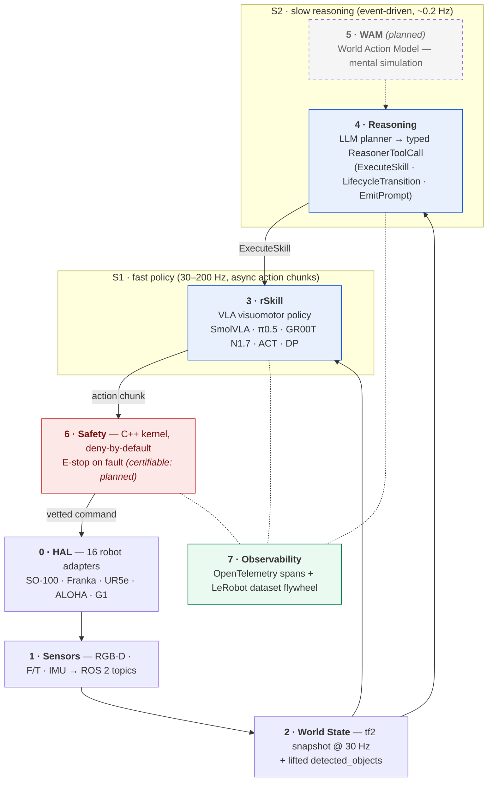

<div align="center">


# OpenRAL

**An open-source operating layer for embodied AI**, OpenRAL unifies fast policies, slow reasoning, and classical control into one typed, traceable, safety-first runtime for deployable robot agents.

[](https://github.com/OpenRAL/openral/actions)
[](https://codecov.io/gh/OpenRAL/openral)
[](https://docs.ros.org/en/jazzy/)
[](LICENSE)
[](pyproject.toml)
[](docs/)
[](https://huggingface.co/OpenRAL)
[](https://discord.gg/ZdNyUT4V5)

[Quick start](#quick-start) · [Architecture](#architecture) · [Robots](docs/reference/robots.md) · [rSkills](docs/reference/rskills.md) · [Sim envs](docs/reference/sim-environments.md) · [Discord](https://discord.gg/GzwUUzCXq) · [Docs](https://openral.github.io/openral/)

</div>

---

## What is OpenRAL?

OpenRAL is a typed, layered runtime that sits between a robot's motor API and a task planner. It is four things in one:

- **Typed runtime** — eight well-defined layers (HAL → Sensors → World State → rSkill → Reasoning → WAM → Safety → Observability) with Pydantic v2 contracts at every boundary.
- **rSkill packaging format** — HuggingFace Hub artifacts containing weights, a `rskill.yaml` manifest, quantisation hints, latency budgets, and reproducible eval. Install like a model: `openral rskill install OpenRAL/rskill-smolvla-libero`.
- **Planning kernel** — a slow LLM-based reasoner (S2) emitting typed `ReasonerToolCall` tool-calls (`ExecuteSkill`, `LifecycleTransition`, `EmitPrompt`, …), and a fast visuomotor policy (S1, 30–200 Hz) executing dispatched skills. Replanning is bounded and explicit.
- **Safety kernel (planned)** — a certifiable C++ separate process, deny-by-default. Python proposes actions; C++ will dispose them. `ROSSafetyViolation` is never silently caught.

We compose ROS 2, tf2, MoveIt 2, Nav2, and `ros2_control` — we don't reinvent them.

**Shipped today** (all workspace packages at `0.1.0`):
- `openral_core` schemas + the `openral` CLI (bare `openral` drops into a REPL)
- HAL adapters for [16 robot platforms](docs/reference/robots.md) — manipulators, bimanual arms, humanoids
- [Sensor catalog](docs/reference/sensors_landscape.md) — RGB-D, F/T, and USB-UVC adapters
- `WorldStateAggregator` — 30 Hz tf2-aware snapshot with lifted object detections
- [31 rSkill packages](docs/reference/rskills.md) — SmolVLA, π0.5, xVLA, MolmoAct2, ACT, Diffusion Policy, RLDX-1, GR00T N1.7 policies, RT-DETR and LocateAnything detectors, and the Qwen3.5-4B scene VLM
- [`openral sim run`](docs/reference/sim-environments.md) — YAML-driven rollouts across [22 benchmark configs](docs/reference/sim-environments.md) (LIBERO, MetaWorld, ManiSkill3, SimplerEnv, RoboCasa, gym-aloha, gym-pusht)
- ADR-0018 reasoner/safety ROS graph + deadman/E-stop forwarders
- OpenTelemetry instrumentation with OTLP export and live `openral dashboard`

Live status: [docs/roadmap/index.md](docs/roadmap/index.md). Per-module canvas: [docs/architecture/repo-state-map.html](docs/architecture/repo-state-map.html).

---

## Features at a glance

| Capability | What you get | Where it lives |
|---|---|---|
| Typed robot manifests | `RobotDescription` (Pydantic v2): joints, links, sensors, embodiment tags, capabilities | `python/core/`, fixtures in `robots/` |
| HAL adapters | Uniform `HAL` Protocol — `connect / read_state / write_command / disconnect`; per-robot lifecycle nodes | `python/hal/`, `packages/openral_hal_*/` |
| Sensor catalog | Typed `SensorSpec` / `SensorBundle` for cameras, depth, IMU, F/T, tactile, lidar | `python/sensors/` |
| World state | 30 Hz tf2-aware snapshot with staleness latching; carries lifted `detected_objects`; consumed by S1 and S2 | `python/world_state/`, `packages/world_state/` |
| Object detection | `kind: detector` rSkills (RT-DETR ONNX today; LocateAnything NF4 artifact packaged) → `ObjectsMetadata`, lifted 2D→3D into world state | `packages/openral_perception_ros/`, ADR-0035/0037 |
| Scene understanding (S2) | `kind: vlm` rSkill (Qwen3.5-4B NF4) → the reasoner's read-only `query_scene` tool for task-progress / success verification ("did the grasp succeed?") | `packages/openral_perception_ros/` (`scene_vlm_node`), ADR-0047 |
| rSkill (S1) runtime | `Skill` ABC, `rSkill` loader (HF Hub), PyTorch / ONNX adapters, async action chunks | `python/rskill/`, `rskills/` |
| Inference runner | One `InferenceRunner` Protocol shared by `openral sim run`, `openral benchmark run`, and `openral deploy` | `python/runner/`, `python/sim/` |
| Sim rollouts | One YAML → reproducible sim rollout; video + metrics + `SkillEvalResult` JSON out | `python/sim/`, `scenes/`, `benchmarks/` |
| Observability | OpenTelemetry SDK + OTLP exporter, span helpers, structlog bridge, live `openral dashboard` | `python/observability/` |
| CLI (`openral`) | `doctor`, `detect`, `connect`, `calibrate`, `rskill`, `sensor`, `sim`, `benchmark`, `deploy`, `dashboard`, `prompt`, `record`, `replay`, `dataset`, `profile`. Bare `openral` → interactive REPL. | `python/cli/` |
| Schemas | Pydantic v2 + JSON Schema export; pre-publish baseline at `schema_version: "0.1"` | `python/core/`, `tools/schema_export.py` |
| ROS 2 IDL | `openral_msgs` (.msg, .action) — normative across the runtime | `packages/msgs/` |

## Supported platforms

OpenRAL ships an **x86 inference Dockerfile** today; a Jetson / L4T family is planned ([ADR-0016](docs/adr/0016-multi-platform-support.md)):

| Image | Target | Notes |
|---|---|---|
| `docker/inference/Dockerfile.x86` | x86_64 + NVIDIA dGPU (Turing–Blackwell) | Default build. `Platform=NVIDIA_DESKTOP`. |
| `docker/inference/Dockerfile.x86` (`WITH_CUDA=0`) | x86_64 CPU-only | `Platform=CPU_ONLY`. |
| `Dockerfile.l4t` *(planned)* | Jetson Orin AGX / Orin NX / Orin Nano | `Platform=TEGRA`; full NVMM zero-copy. |
| `Dockerfile.l4t` *(planned, degraded)* | Jetson Xavier / Xavier NX | CC 7.2 → FP16/INT8 only. |
| `Dockerfile.l4t` *(planned, best-effort)* | Maxwell Nano (legacy) | No CI signal. |

`openral doctor` prints which of `x86-cuda` / `x86-cpu` / `l4t-orin` / `l4t-xavier` / `l4t-nano-maxwell` / `unsupported` the host matches. Apple Silicon is a development affordance only — no deploy image.

---

## Quick start

One-liner install (no clone, no sudo):

```bash
curl -fsSL https://raw.githubusercontent.com/OpenRAL/openral/master/scripts/install.sh | bash
openral doctor                  # verify environment
openral install sim             # opt-in: CPU sim physics
openral install ros             # opt-in: ROS 2 + apt (needs sudo)
```

Heavy extras (LIBERO, RoboCasa, MetaWorld, ManiSkill3, SimplerEnv, ROS 2) are installed on demand via `openral install <group>` or automatically on first `openral sim run` against a scene that needs them. See `openral install list` for the full menu.

> **Pre-PyPI gap.** `openral-cli` is not yet on PyPI. Until then:
> ```bash
> curl -fsSL https://raw.githubusercontent.com/OpenRAL/openral/master/scripts/install.sh \
>   | OPENRAL_INSTALL_SOURCE=git+https://github.com/OpenRAL/openral bash
> ```
> See [ADR-0021](docs/adr/0021-curl-installer-cli-rename-and-pypi-release.md).

For contributors (full clone + ROS 2 + `colcon`):

```bash
git clone https://github.com/OpenRAL/openral && cd openral
just quickstart         # bootstrap → uv sync → ros2-build → openral REPL
```

Or step-by-step:

```bash
just bootstrap                  # uv + ROS 2 Jazzy + system deps
uv sync --all-packages          # resolve & install workspace
just ros2-build                 # colcon build
source install/setup.bash
uv run openral doctor
```

The `openral` CLI lives in `.venv/bin/openral`. Run via `uv run openral ...` or `source .venv/bin/activate`. For a global install: `uv tool install --editable python/cli`.

`uv run openral doctor` output on a working machine:

```
         openral doctor
┏━━━━━━━━━━━━━━━━━━━━┳━━━━━━━━━┳━━━━━━━━━━━━━━━━━━━━━━━━━━━━━━━━┓
┃ check              ┃ status  ┃ details                        ┃
┡━━━━━━━━━━━━━━━━━━━━╇━━━━━━━━━╇━━━━━━━━━━━━━━━━━━━━━━━━━━━━━━━━┩
│ Python             │ ok      │ 3.12.9                         │
│ Platform           │ info    │ Linux 6.14.0                   │
│ openral-core       │ ok      │ 0.1.0                          │
│ ROS 2 binary       │ ok      │ /opt/ros/jazzy/bin/ros2        │
│ ROS 2 distro       │ ok      │ jazzy                          │
│ RMW                │ info    │ rmw_fastrtps_cpp (default)     │
│ colcon             │ ok      │ /usr/bin/colcon                │
│ GPU 0              │ ok      │ NVIDIA RTX 4090 (24576 MiB)    │
│ USB devices        │ info    │ none found                     │
│ just               │ ok      │ /usr/local/bin/just            │
└────────────────────┴─────────┴────────────────────────────────┘
```

---

## Architecture



```
0  HAL              Hardware Abstraction Layer — per-robot adapters (SO-100, G1, UR5e…)
1  Sensors          SensorSpec → ROS 2 topic streams (RGB, depth, IMU, lidar, tactile)
2  World State      tf2-aware typed snapshot at 30 Hz; folds in object detections
3  rSkill (S1)       Fast visuomotor policy (VLA, 30–200 Hz, async action chunks)
4  Reasoning (S2)   Slow LLM planner emitting typed ReasonerToolCall tool-calls
5  WAM              Optional World Action Model for mental simulation (planned)
6  Safety           C++ separate process, deny-by-default, certifiable, E-stop on fault
7  Observability    OpenTelemetry spans + LeRobotDataset v3 flywheel
```

Layer boundaries are enforced by Pydantic v2 schemas in `python/core/`. Crossing a layer without an ADR is rejected in review. Per-module live status: [docs/architecture/repo-state-map.html](docs/architecture/repo-state-map.html). Architecture deep-dive: [docs/architecture/overview.md](docs/architecture/overview.md).

---

## Run commands (cheat sheet)

```bash
# Environment
just bootstrap && uv sync --all-packages
uv run openral doctor

# Discovery
uv run openral detect                        # auto-detect robot + sensors → robot.yaml
uv run openral sensor list                   # browse the sensor catalog
uv run openral rskill list                   # list installed rSkills
uv run openral rskill install OpenRAL/rskill-smolvla-libero
uv run openral benchmark report              # aggregate eval/*.json results

# Simulated rollouts — see docs/reference/sim-environments.md
just sim-libero                              # SmolVLA × LIBERO
just sim-pi05-libero                         # π0.5 × LIBERO (≥8 GB VRAM)
just sim-act-aloha                           # ACT × gym-aloha bimanual

# Observability
uv run openral dashboard                     # OTLP receiver at :4318

# Hardware deployment
uv run openral deploy run --config deployments/<your-deployment>.yaml
uv run openral deploy sim --config scenes/deploy/openarm_tabletop.yaml
just hil so100                               # SO-100 HIL (USB + servos)

# Quality gates
just test && just lint                       # unit suite + ruff + mypy --strict
just test-changed                            # only tests a `git diff` can affect — see docs/contributing/selective-testing.md
just ros2-build && just ros2-test
just schema-export && just docs
```

Full toolchain: [docs/contributing/toolchain.md](docs/contributing/toolchain.md). Test inventory: [tests/README.md](tests/README.md). Selective testing: [docs/contributing/selective-testing.md](docs/contributing/selective-testing.md).

---

## Robot descriptions

16 robot platforms are supported, from low-cost manipulators to bimanual arms and humanoids. Each is a typed `RobotDescription` manifest under `robots/<robot_id>/robot.yaml`.

→ **Full table:** [docs/reference/robots.md](docs/reference/robots.md)

Quick examples: SO-100/SO-101 (HW + sim), Franka Panda, UR5e/UR10e, ALOHA bimanual, OpenArm v2, Unitree H1/G1, Rethink Sawyer, Fourier GR1.

---

## Sensors

The sensor catalog ships typed adapters wrapping vendor SDKs into `SensorSpec` / `SensorBundle` records. Browse with `openral sensor list`; resolve one with `openral sensor show <id>`.

**Shipped:** RealSense D435/D435i/D415, Luxonis OAK-D Pro, USB UVC (generic RGB), Robotiq FT-300.

**Planned:** Orbbec, lidar (Ouster / Livox / Hokuyo / SLAMTEC), standalone IMU, tactile (DIGIT / GelSight).

→ **Full catalog & roadmap:** [docs/reference/sensors_landscape.md](docs/reference/sensors_landscape.md)

---

## Sim environments

22 benchmark configs span LIBERO, MetaWorld, ManiSkill3, SimplerEnv, RoboCasa, gym-aloha, and gym-pusht. Each YAML is a complete `SimEnvironment` — one command to run.

→ **Full config index:** [docs/reference/sim-environments.md](docs/reference/sim-environments.md)

---

## rSkills

rSkills are HuggingFace-Hub-shaped packages — manifest + weights + reproducible `eval/` — installed and run with the `openral rskill` CLI.

Policy rSkills (SmolVLA, π0.5, xVLA, MolmoAct2, ACT, Diffusion Policy, RLDX-1), 3 perception detector rSkills (RT-DETR and LocateAnything), and the Qwen3.5-4B scene VLM (`kind: vlm`, drives the read-only `query_scene` tool) are published under `OpenRAL/rskill-*` on HuggingFace Hub. LocateAnything is private and non-commercial; Qwen3.5-4B is Apache-2.0. The GR00T N1.7 policy (`gr00t-n17-libero`, NVIDIA Open Model License) ships in-tree and loads upstream `nvidia/GR00T-N1.7-LIBERO` weights via an out-of-process sidecar (ADR-0046).

→ **Full table + license notes:** [docs/reference/rskills.md](docs/reference/rskills.md)

```bash
openral rskill install OpenRAL/rskill-smolvla-libero
openral rskill check    # which installed rSkills run on this host?
```

---

## Supported VLAs

See [CLAUDE.md §3](CLAUDE.md) for the full model-by-model license matrix and adapter status. Compatibility matrix (observed obs/action dims, normalisation): [docs/reference/vla_compatibility.md](docs/reference/vla_compatibility.md).

---

## Development

```bash
just test           # full unit suite, <30 s
just lint           # ruff + mypy --strict
just docs           # serve docs at http://localhost:8000
```

Test suite inventory and coverage matrix: [tests/README.md](tests/README.md). Full setup guide: [docs/contributing/development.md](docs/contributing/development.md). Dev container (VS Code / Codespaces): `F1 → Reopen in Container`.

---

## Contributing

See [CONTRIBUTING.md](CONTRIBUTING.md). All contributions are Apache-2.0.

The engineering playbook (coding standards, layer discipline, PR checklist, exception hierarchy) lives in [CLAUDE.md](CLAUDE.md). The public-symbol inventory is [docs/METHODS.md](docs/METHODS.md) — search it before adding a new helper.

---

## Community & support

- **[Discord](https://discord.gg/GzwUUzCXq)** — questions, help, design chat
- **General enquiries:** hello@openral.dev
- **Robot safety / coordinated disclosure:** safety@openral.dev (see [SECURITY.md](SECURITY.md))
- **Security vulnerabilities:** [private vulnerability reporting](https://github.com/OpenRAL/openral/security/advisories/new) or security@openral.dev — **never** a public issue
- **Code of Conduct reports:** conduct@openral.dev

See [SUPPORT.md](SUPPORT.md), [CONTRIBUTING.md](CONTRIBUTING.md), and [GOVERNANCE.md](GOVERNANCE.md).

---

## License

OpenRAL is licensed entirely under **Apache-2.0** ([ADR-0012](docs/adr/0012-open-core-licensing.md)). Every package in this repository — contracts, runtime substrate, simulators, HAL & sensors, observability, safety code, the LLM reasoner, WAM adapters, dispatcher, skill catalog, fleet orchestration, examples, tests, tools, scripts, and manifests — ships under the same permissive license. There is no commercial, source-available, or otherwise non-open tier. See [LICENSE](LICENSE) and [`LICENSES/Apache-2.0.txt`](LICENSES/Apache-2.0.txt).

rSkill weights distributed via Hugging Face Hub remain governed by their own upstream licenses (Apache-2.0 / MIT / research-permissive / NVIDIA non-commercial / …); the loader surfaces each weight's posture at install time. This is third-party license lineage for models OpenRAL does not own — it does not affect the Apache-2.0 license of OpenRAL's own code.
