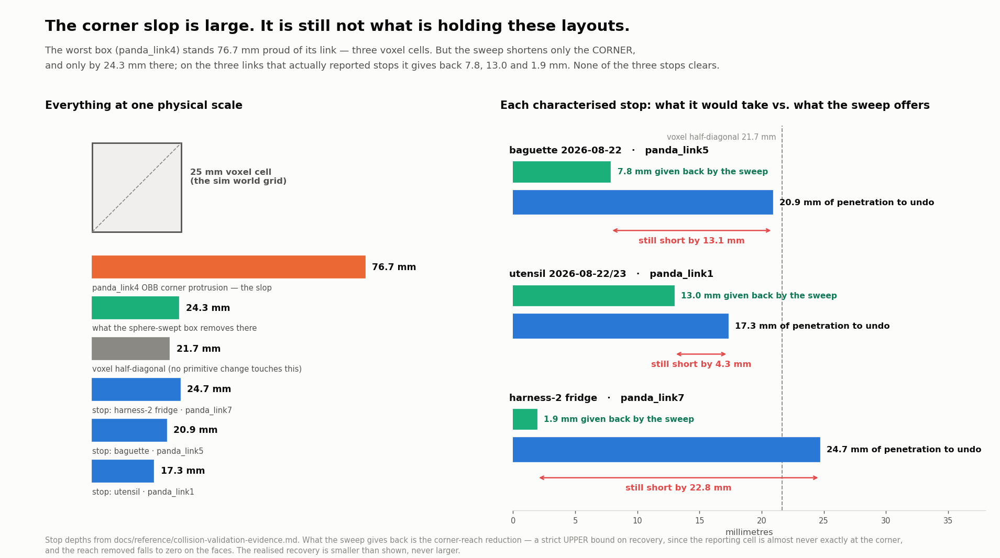
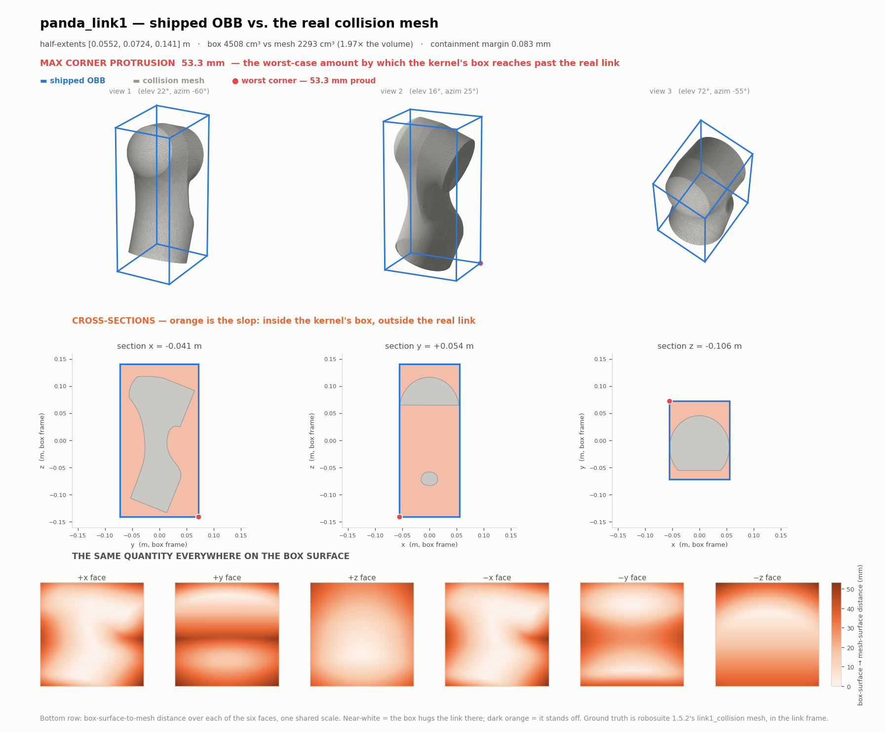
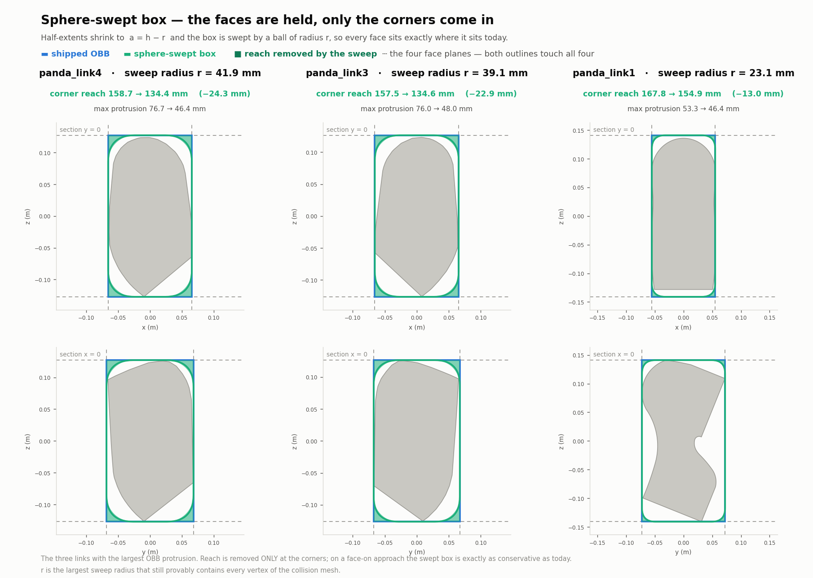
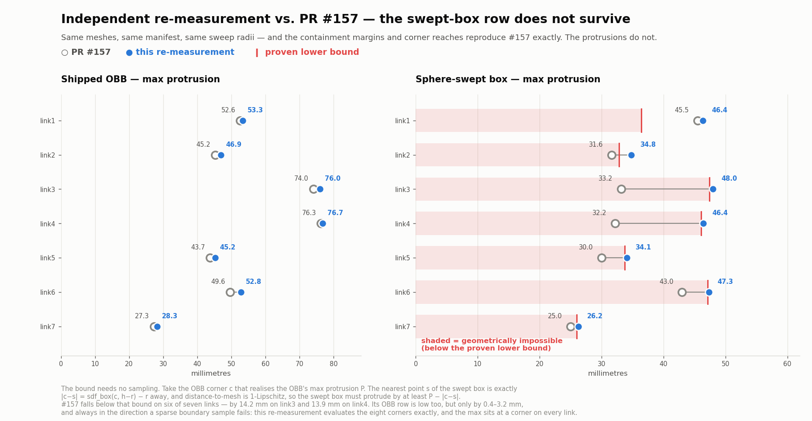

# What the kernel's link boxes actually enclose — in pictures

> **Status: measurement only.** No kernel, manifest or schema change. This page
> renders the geometry that
> [the collision-primitive study](https://github.com/OpenRAL/openral/pull/157) (PR #157) argues about in
> prose, and re-derives its fit numbers from the meshes independently.
>
> Everything below is `panda_mobile`'s `collision_geometry` — `panda_link1` …
> `panda_link7`, the only links the C++ safety kernel places a primitive on.
> There is no base box and no gripper box; see the study's §1 for why.

Ground truth is robosuite 1.5.2's `link<N>_collision` mesh geoms — the same
meshes `sim_sensor_bridge._body_collision_points` samples — placed in the link
frame and compared against the half-extents and `origin_xyz_rpy` committed in
`robots/panda_mobile/robot.yaml`.

---

## 1. The headline

The slop is real and it is large: the worst box (`panda_link4`) stands **76.7 mm**
proud of its own link at the corner — three voxel cells. But the sphere-swept box
only shortens the *corner*, and on the three links that actually reported stops
it hands back 7.8, 13.0 and 1.9 mm against penetrations of 20.9, 17.3 and
24.7 mm. **None of the three stops clears.** That is the study's §6 result, drawn
to scale.

---

## 2. Per link: the box, the mesh, and the gap between them

Each figure has three parts:

* **top** — the collision mesh inside the shipped OBB, from three viewing angles,
  with the worst corner marked;
* **middle** — three orthogonal cross-sections, with everything *inside the box
  and outside the mesh* shaded orange. That orange area is the entire subject;
* **bottom** — the box-surface-to-mesh distance sampled over all six faces on one
  shared scale. Near-white where the box hugs the link, dark where it stands off.

| link | max corner protrusion | box ÷ mesh volume | containment margin |
|---|---|---|---|
| [`panda_link1`](images/collision-primitives/panda_link1-obb-vs-mesh.png) | **53.3 mm** | 1.97× | 0.083 mm |
| [`panda_link2`](images/collision-primitives/panda_link2-obb-vs-mesh.png) | **46.9 mm** | 1.49× | 0.055 mm |
| [`panda_link3`](images/collision-primitives/panda_link3-obb-vs-mesh.png) | **76.0 mm** | 1.91× | 0.088 mm |
| [`panda_link4`](images/collision-primitives/panda_link4-obb-vs-mesh.png) | **76.7 mm** | 1.93× | 0.083 mm |
| [`panda_link5`](images/collision-primitives/panda_link5-obb-vs-mesh.png) | **45.2 mm** | 1.48× | 0.083 mm |
| [`panda_link6`](images/collision-primitives/panda_link6-obb-vs-mesh.png) | **52.8 mm** | 1.69× | 0.132 mm |
| [`panda_link7`](images/collision-primitives/panda_link7-obb-vs-mesh.png) | **28.3 mm** | 1.66× | 0.098 mm |

Two things fall out of the pictures that the table cannot show.

**The maximum is at an exact box corner on all seven links.** Not near one — at
one. The face-distance panels make this obvious: the faces are near-white
(the box is fitted tight against them, to within tens of microns) and the slop
piles up entirely in the eight corners.

**`panda_link1` is the odd one out.** Its `+y` face panel shows a dark *band*,
not dark corners, because link1 is the one genuinely non-convex link in the set
(30 % convex-hull excess — the other six collision meshes already *are* their own
convex hulls). Its cross-section shows the concavity directly.

---

## 3. The sphere-swept box: faces held, corners in

The construction is `a = h − r` swept by a ball of radius `r`, so every face
plane stays exactly where it is today. The dashed lines in each panel are the
four face planes: both the blue rectangle and the green rounded outline are
tangent to all four. Only the corners move, and only inward — the shaded green
slivers.

`r` is the largest sweep radius that still provably contains **every vertex** of
the collision mesh, found by bisection at 0.1 mm and verified by containment,
not by an optimiser's tolerance.

| | link3 | link4 | link1 |
|---|---|---|---|
| sweep radius `r` | 39.1 mm | 41.9 mm | 23.1 mm |
| corner reach | 157.5 → 134.6 mm | 158.7 → 134.4 mm | 167.8 → 154.9 mm |
| **reach removed** | **−22.9 mm** | **−24.3 mm** | **−13.0 mm** |

Reach removed on the remaining links: link2 −11.0, link5 −7.8, link6 −5.1,
link7 −1.9 mm.

---

## 4. Where this disagrees with PR #157 — and why the disagreement matters

This re-measurement reproduces #157's **containment margins exactly** on all
seven links (0.083 / 0.055 / 0.088 / 0.083 / 0.083 / 0.132 / 0.098 mm), its
**corner reaches exactly**, and its **sweep radii** to the resolution #157
reported them. Same meshes, same manifest, same frames.

The protrusion columns do not agree.

| | link1 | link2 | link3 | link4 | link5 | link6 | link7 |
|---|---|---|---|---|---|---|---|
| OBB — #157 | 52.6 | 45.2 | 74.0 | 76.3 | 43.7 | 49.6 | 27.3 |
| OBB — here | **53.3** | **46.9** | **76.0** | **76.7** | **45.2** | **52.8** | **28.3** |
| swept — #157 | 45.5 | 31.6 | 33.2 | 32.2 | 30.0 | 43.0 | 25.0 |
| swept — here | **46.4** | **34.8** | **48.0** | **46.4** | **34.1** | **47.3** | **26.2** |
| *proven lower bound* | *36.4* | *32.8* | *47.4* | *46.1* | *33.7* | *47.1* | *26.0* |

**The OBB row is a sampling difference and is not interesting.** #157 sampled
12 000 points on the primitive boundary; this measurement evaluates the eight
corners *exactly* in addition to a face grid. Since the maximum provably sits at
a corner on every link, the exact evaluation is the tighter and more correct
number, and the gap is one-directional and small (0.4–3.2 mm).

**The swept-box row is a real error in #157, and it can be settled without any
sampling at all.** Let `c` be the OBB corner realising the OBB's max protrusion
`P`, and `S = Box(h − r) ⊕ B(r)`. The point of `S` nearest to `c` is exactly
`|c − s| = sdf_box(c, h − r) − r` away, and distance-to-a-mesh is 1-Lipschitz,
so `S` must protrude by at least `P − |c − s|`. That is the italic row above.

**#157's swept-box figures fall below that bound on six of seven links** — by
14.2 mm on link3 and 13.9 mm on link4 — and they fall below it even when the
bound is computed from #157's *own* (lower) OBB numbers on links 3, 4, 5 and 6.
Every value measured here sits just above the bound, which is the expected
signature of a boundary sampler that is finding the true maximum.

The likely mechanism is #157's swept-boundary sampler: it pushed box-surface
points along *random* outward directions and kept only those landing at distance
exactly `r`, which under-covers the rounded corner shell — precisely where the
maximum lives, and worst on the links with the largest `r` (link3 and link4, at
39 and 42 mm). This measurement instead bisects along a 24 000-direction set with
the eight corner directions inserted explicitly.

**What this changes, and what it does not.** It makes the swept box *less*
attractive, not more: the real tightening on link3 is 76.0 → 48.0 mm (37 %), not
74.0 → 33.2 mm (55 %). The study's §6 recovery analysis is untouched, because
that argument runs on **corner reach**, which reproduces exactly. So §8.1's
recommendation — do not make the primitive change yet — stands, and stands on
slightly firmer ground.

---

## 5. Reproducing these

Inputs, environment and method are as in
[the study's §9](https://github.com/OpenRAL/openral/pull/157), with
these differences, all of which move the numbers in the conservative direction:

* **Mesh placement.** Vertices come from `mesh_vert` placed by the geom
  transform **only**. MuJoCo recentres asset vertices at compile time and folds
  the compensating transform into the geom frame — for this MJCF `geom_pos` /
  `geom_quat` come out exactly equal to `mesh_pos` / `mesh_quat`, so applying
  both double-counts it and puts the mesh 80–180 mm out of frame. Verified
  against the raw STL assets to 7 × 10⁻⁹ m.
* **OBB boundary sampling.** A 60 × 60 grid per face (21 600 points) plus all 12
  edges and, decisively, the 8 corners evaluated exactly.
* **Swept boundary sampling.** Bisection along a 24 000-point Fibonacci
  direction set plus the 8 corner directions, solving `sdf_box(q, a) = r` to
  machine precision — the swept body is star-shaped about its centre, so this is
  exact per direction.
* **Sweep radius.** Swept at 0.1 mm rather than 1 mm.
* **Containment.** Every mesh vertex checked; the primitive is convex, so
  containing the vertices proves containing `conv(vertices) ⊇ mesh`.

Environment: workspace `.venv` — numpy 2.2.6, scipy 1.17.1, trimesh 4.12.2,
shapely, mujoco 3.8.0, robosuite 1.5.2, matplotlib 3.10.9. CPU only; no GPU work
is involved.

---

## See also

* [Collision-primitive study (PR #157)](https://github.com/OpenRAL/openral/pull/157) — the geometry
  argument, the full candidate table, and the cost/safety-WG analysis.
* [Collision-stack validation evidence](collision-validation-evidence.md) — the
  failure census the three characterised stops come from.
