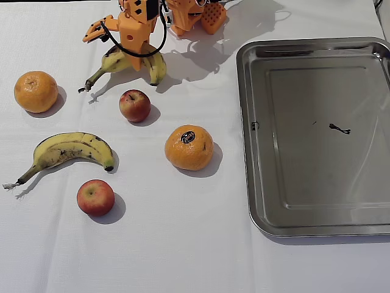
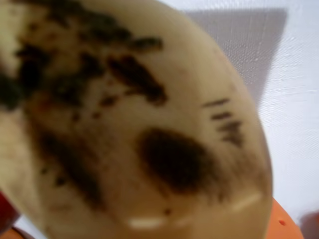

---
language:
- en
license: other
license_name: nvidia-open-model-license
pipeline_tag: robotics
tags:
- OpenRAL
- rskill
- gr00t
- vision-language-action
- so101_follower
- gr00t-n1.7
- vla
- so101
- so-arm
- lerobot
- manipulation
inference: false
base_model:
- nvidia/GR00T-N1.7-3B
base_model_relation: finetune
---

# rskill-gr00t-n17-so101-fruit

> **OpenRAL rSkill** — NVIDIA Isaac **GR00T N1.7** (3B) community-finetuned to
> pick fruit and place it on a tray with the **SO-101** follower arm, packaged
> for the [OpenRAL](https://github.com/OpenRAL/openral) robot agent framework.

This package wraps [`aaronsu11/GR00T-N1.7-3B-SO101-FruitPicking`](https://huggingface.co/aaronsu11/GR00T-N1.7-3B-SO101-FruitPicking)
with a `rskill.yaml` manifest that adds capability checking, license surfacing,
latency budgets, and local registry integration. It does **not** copy model
weights.

## Preview

Frames from the training set ([`aaronsu11/so101_fruit`](https://huggingface.co/datasets/aaronsu11/so101_fruit),
episode 100, mid-trajectory). Left: the fixed **front** camera — SO-101, three
fruits, and the target tray. Right: the in-hand **wrist** camera as the gripper
closes on the banana.

## Upstream model, architecture & training

| Field | Value |
|---|---|
| Source repo | [`aaronsu11/GR00T-N1.7-3B-SO101-FruitPicking`](https://huggingface.co/aaronsu11/GR00T-N1.7-3B-SO101-FruitPicking) |
| Base model | [`nvidia/GR00T-N1.7-3B`](https://huggingface.co/nvidia/GR00T-N1.7-3B) |
| VLM backbone | Cosmos-Reason2-2B (Qwen3-VL layout, SigLip2 vision encoder) |
| Action head | Diffusion transformer (flow matching, 4 inference steps) |
| Paper | [arXiv:2503.14734](https://arxiv.org/abs/2503.14734) — *GR00T N1: An Open Foundation Model for Generalist Humanoid Robots* |
| Parameters | ~3.1 B |
| License | NVIDIA Open Model License Agreement (**commercial use permitted**) |
| Finetune data | [`aaronsu11/so101_fruit`](https://huggingface.co/datasets/aaronsu11/so101_fruit) — 200 SO-101 teleop episodes, front + wrist RGB, 4 fruit tasks |
| Finetune recipe | Isaac-GR00T on the `new_embodiment` tag, 6000 steps, bf16 |

GR00T is a cross-embodiment foundation model with variable-dimension
proprioception and per-embodiment action heads. This checkpoint specializes the
N1.7 base on an SO-101 fruit pick-and-place embodiment. The training config
(`experiment_cfg/conf.yaml`) pins:

- **embodiment_tag** `new_embodiment` (id 10)
- **video** modality keys `front`, `wrist`
- **state** modality `single_arm` + `gripper` → 6-D
- **action** modality `single_arm` + `gripper` → 6-D, 16-step horizon,
  absolute (`use_relative_action: false`)

## Supported robots / embodiments

| Robot | OpenRAL embodiment tag | GR00T tag | Status | Notes |
|---|---|---|---|---|
| SO-101 follower | `so101_follower` | `new_embodiment` | packaged | 6-DoF Feetech STS3215 servo chain (5 arm + gripper) |

The manifest declares OpenRAL's `so101_follower`; the loader passes GR00T's own
`new_embodiment` tag (from `policy_extras.embodiment_tag`) into the checkpoint's
modality config.

## Sensors / observation contract

| Key | Type | Min resolution | Description |
|---|---|---|---|
| `observation.images.camera1` | RGB camera | 224 × 224 | Front / fixed workspace view (`front`) |
| `observation.images.camera2` | RGB camera | 224 × 224 | Wrist / in-hand view (`wrist`) |
| state | Proprioception | (6,) | 5 arm joint positions + gripper, degrees |

The policy emits a 16-step action chunk; each action is 6-D absolute
joint-position (`joint_positions`, degrees). Images and state are normalized
inside the GR00T checkpoint's own `experiment_cfg` / `statistics.json` metadata
rather than a lerobot processor pipeline — hence no `processors` block in the
manifest. SO-101 frames are recorded upright, so no 180° flip is applied
(unlike the LIBERO GR00T checkpoints).

## Manifest summary

| Field | Value |
|---|---|
| `name` | `OpenRAL/rskill-gr00t-n17-so101-fruit` |
| `version` | `0.1.0` |
| `license` | `nvidia_open_model` (commercial OK) |
| `role` | `s1` |
| `model_family` | `gr00t` |
| `embodiment_tags` | `so101_follower` |
| `policy_extras.embodiment_tag` | `new_embodiment` |
| `runtime` | `pytorch` (in-process lerobot `GrootPolicy`) |
| `quantization.dtype` | `bf16` shipped; whole-model NF4 on load (`quantize_scope: model`) |
| `min_vram_gb` | `bf16: 12.0`, `int4: 6.0` (measured 5.8 GiB peak) |
| `weights_uri` | `hf://aaronsu11/GR00T-N1.7-3B-SO101-FruitPicking` |
| `chunk_size` | 16 |
| `state_contract.dim` / `action_contract.dim` | 6 / 6 |
| `latency_budget.per_chunk_ms` | 1500 ms (3B inference) |

Full schema: [`openral_core.schemas.RSkillManifest`](../../python/core/src/openral_core/schemas.py).

## Hardware

GR00T N1.7-3B (bf16, ~6 GB weights) plus the Cosmos-Reason VLM does not co-fit
an 8 GB GPU. The in-process `gr00t` adapter NF4-quantizes it on load
(`OPENRAL_GR00T_QUANTIZATION` default `nf4`). This checkpoint's DiT action head
is **32 layers** (LIBERO's is 16), so leaving it bf16 (backbone-only NF4)
overshoots 8 GB; the manifest sets `policy_extras.quantize_scope: model` to pack
the whole model — the 4M-param threshold spares the small `TimestepEncoder`, so
the historical DiT uint8 bug cannot recur. **GPU-verified: 5.8 GiB peak on an
8 GB RTX 4070** (`tests/sim/test_so101_groot_fruit.py`, real weights + NF4 +
processors). A ≥ 16 GB GPU can run bf16 directly (`OPENRAL_GR00T_QUANTIZATION=none`).

> **Runtime status.** The in-process `gr00t` adapter
> (`openral_sim.policies.gr00t`) reads the state/action width, GR00T video
> modality keys, embodiment tag, and quantization scope from this manifest, so
> the SO-101 6-D/`new_embodiment` contract drives the same path the LIBERO
> checkpoint uses. Emitting valid 6-D action chunks is verified live on GPU
> (see Hardware). Reproducing a **task success rate** needs an SO-101 fruit sim
> scene with dataset-matched joint calibration — not yet built; the current
> `so101_box` scene is geometry-only.

## License

This rSkill package (`rskill.yaml`, `README.md`, `assets/`) is **Apache-2.0**.

The wrapped model weights ([`aaronsu11/GR00T-N1.7-3B-SO101-FruitPicking`](https://huggingface.co/aaronsu11/GR00T-N1.7-3B-SO101-FruitPicking),
finetuned from [`nvidia/GR00T-N1.7-3B`](https://huggingface.co/nvidia/GR00T-N1.7-3B))
are governed by the **NVIDIA Open Model License Agreement**, which permits
commercial use. This is the key distinction from GR00T N1 / N1.5 / N1.6, which
ship under the NVIDIA OneWay Noncommercial License and are blocked in commercial
deployments by the OpenRAL loader unless `OPENRAL_ALLOW_NONCOMMERCIAL=1` is set
(CLAUDE.md §3). The `so101_fruit` training dataset is Apache-2.0.
