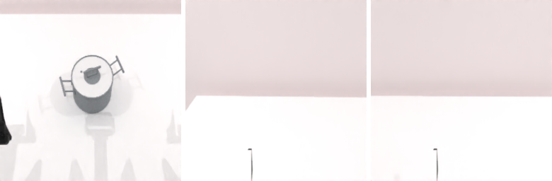

---
language:
- en
license: apache-2.0
pipeline_tag: robotics
tags:
- OpenRAL
- rskill
- lingbot_vla2
- vision-language-action
- nf4
- 4-bit
- aloha_agilex
- lingbot-vla2
- vla
- robotwin
- bimanual
- manipulation
inference: false
---

# rskill-lingbot-vla2-robotwin

> **OpenRAL rSkill** — Robbyant **LingBot-VLA 2.0** (6.38 B, Qwen3-VL-4B backbone +
> sparse-MoE flow-matching action expert) for dual-arm manipulation on the
> **RoboTwin 2.0** / AgileX "Cobot Magic" embodiment, packaged for use with the
> [OpenRAL](https://github.com/OpenRAL/openral) robot agent framework.

This package wraps
[`robbyant/lingbot-vla-v2-6b`](https://huggingface.co/robbyant/lingbot-vla-v2-6b)
(upstream code: [`github.com/robbyant/lingbot-vla-v2`](https://github.com/robbyant/lingbot-vla-v2)
@ `69729b4`) with an `rskill.yaml` manifest that adds capability checking, license
surfacing, latency budgets, and local registry integration. Its `weights_uri`
points at the **NF4 pre-quantized mirror**
[`OpenRAL/lingbot-vla-v2-6b-nf4`](https://huggingface.co/OpenRAL/lingbot-vla-v2-6b-nf4)
(~6.8 GB packed vs 25.5 GB fp32), so a deploy downloads the already-quantized
weights and skips the per-boot NF4 conversion. Loading a pre-quantized pack
requires a **CUDA GPU** (bitsandbytes has no CPU 4-bit kernel); for a CPU / bf16
or ≥16 GB-card bf16 load, override `vla.extra.model_id` (or
`OPENRAL_LINGBOT_VLA2_DEVICE=cpu` with `model_id`) to the fp32 upstream
`robbyant/lingbot-vla-v2-6b`.

## What this skill does

A multi-task dual-arm policy for the RoboTwin 2.0 benchmark on the AgileX
"aloha-agilex" embodiment. Predicts 50-step action chunks across three RGB views
(head + per-wrist) driving a 14-DoF dual-arm joint command, replaying 25 steps
before re-inferring (matching the upstream `--use_length 25` deploy).

| Field | Value |
| --- | --- |
| Actions | `generalist`, `pick`, `place`, `transfer`, `pour` |
| Objects | `block`, `bottle`, `cup`, `bowl` |
| Scenes  | `tabletop` |
| Embodiment | `aloha_agilex` (AgileX Cobot Magic, dual-arm) |
| Action space | 14-D joint position (2×(6 arm + 1 gripper)) |
| Cameras | `camera1` (head), `camera2` (left wrist), `camera3` (right wrist), 256×256 |



> **Preview.** A real RoboTwin 2.0 (SAPIEN, `aloha_agilex`) render of the three
> 256×256 RGB views this skill consumes — head (left), left wrist, right wrist. A
> model-in-the-loop rollout clip is not shipped because the 6.9 GB NF4 model and
> the 1.9 GB SAPIEN env cannot co-reside on the 8 GB reference GPU (see
> [Evaluation](#evaluation)); the model path itself is verified live (real NF4
> forward pass + passing sim test, below).

## Upstream model / how it works

LingBot-VLA 2.0 is a 6.38 B model: a `Qwen3-VL-4B-Instruct` vision-language
backbone feeds a sparse **mixture-of-experts** flow-matching **action expert**
(10 denoising steps) that emits a 14-D action per step. OpenRAL loads the upstream
`LingbotVLAv2Server` through the out-of-process `lingbot_vla2` adapter
(`openral_sim.policies.lingbot_vla2`): the model returns the unnormalized
`action.arm.position` (12) + `action.effector.position` (2) per step, the sidecar
flattens them to a `(50, 14)` chunk, and the adapter replays 25 of those 14-D
steps per re-inference.

The upstream `lingbotvla` package pins `torch==2.8.0` / `transformers==4.57.3` /
`triton==3.4.0` and ships custom Triton MoE kernels, which cannot coexist with the
OpenRAL `torch>=2.9` / `transformers>=5` runtime (CLAUDE.md §3). The model
therefore runs in an **auto-provisioned Python 3.12 + torch-2.8 ZMQ sidecar**
(`tools/lingbot_vla2_sidecar.py` clones the pinned upstream repo + builds the venv;
`tools/_lingbot_vla2_server.py` serves `ping`/`reset`/`get_action`/`close`). Because
`flash-attn` is not installed, the server coerces the upstream `flash_attention_2`
hardcode to `sdpa` (or `eager`).

### Sensors / observation contract

| Direction | Key | Shape | Notes |
| --- | --- | --- | --- |
| in | `observation.images.camera1` | `(256, 256, 3)` RGB uint8 | Head / overhead view → upstream `cam_high`. |
| in | `observation.images.camera2` | `(256, 256, 3)` RGB uint8 | Left wrist view → upstream `cam_left_wrist`. |
| in | `observation.images.camera3` | `(256, 256, 3)` RGB uint8 | Right wrist view → upstream `cam_right_wrist`. |
| in | `observation.state` | `(14,) float32` | aloha-agilex dual-arm joint state `[arm_l(6) grip_l(1) arm_r(6) grip_r(1)]`, radians. |
| out | action chunk | `(50, 14) float32` | Absolute dual-arm joint position commands (25 replayed per re-inference). |

## Verified performance (RTX 4070 Laptop, 8 GB)

Measured live on a single 8 GB RTX 4070 Laptop GPU through the real ZMQ sidecar
(NF4 Qwen3-VL backbone + bf16 MoE expert, `sdpa`, 10 denoising steps). The raw
sidecar reply is a finite `(50, 14)` chunk; the adapter replays 25 steps.

| Metric | Value |
| --- | --- |
| Resident weights (post-load) | **6.84 GB** (pre-quantized NF4 overlay) |
| Peak VRAM (during inference) | **6.97 GB** (fits 8 GB with ~1 GB headroom) |
| Download | **~6.8 GB** packed NF4 (vs 25.5 GB fp32) — one-time |
| Cold load (download cached → CPU graph build → NF4 overlay → CUDA) | **~90 s** |
| Per-chunk inference latency | mean **804 ms**, median 746 ms, **p95 976 ms**, max 1110 ms (10 calls; cold first call ~1650 ms) |
| Action chunk | `(50, 14)` finite; adapter replays 25 |

The pre-quantized pack skips the fp32 read (6.8 GB vs 25.5 GB download) and the
~30 s on-line bitsandbytes pack; wall-clock cold load is dominated by the 6.38 B
graph construction + cold torch/transformers import, so it is comparable to the
fp32 path rather than dramatically faster. The overlaid backbone weights
dequantize **bitwise-identically** (`max|Δ| = 0`) to a fresh on-line
`.to("cuda")` pack of the same fp32 source (verified on sampled modules).

Reproduced by `tests/sim/test_aloha_agilex_lingbot_vla2_robotwin.py` (3 real
inferences: finite 14-D action, multi-step chunk, VRAM < 8 GiB) — all passing.

## How it was trained

LingBot-VLA 2.0 is Robbyant's second-generation VLA, described in *"From
Foundation to Application: Improving VLA Models in Practice"*. This rSkill is a
thin wrapper; the runtime weights come from the OpenRAL NF4 mirror of the upstream
checkpoint (an NF4-quantized copy, not a re-train).

| Field | Value |
| --- | --- |
| Weights (runtime) | [`OpenRAL/lingbot-vla-v2-6b-nf4`](https://huggingface.co/OpenRAL/lingbot-vla-v2-6b-nf4) @ `773051f` (NF4 backbone / bf16 expert, ~6.8 GB) |
| Upstream checkpoint | [`robbyant/lingbot-vla-v2-6b`](https://huggingface.co/robbyant/lingbot-vla-v2-6b) @ `11c703b` (fp32, ~25.5 GB) |
| Upstream code | [`github.com/robbyant/lingbot-vla-v2`](https://github.com/robbyant/lingbot-vla-v2) @ `69729b4` |
| Base backbone | [`Qwen/Qwen3-VL-4B-Instruct`](https://huggingface.co/Qwen/Qwen3-VL-4B-Instruct) |
| Paper | [huggingface.co/papers/2607.06403](https://huggingface.co/papers/2607.06403) |
| License | apache-2.0 (code **and** weights) |
| Parameters | 6.38 B (NF4 backbone + bf16 expert, ~6.8 GB packed; 25.5 GB fp32 upstream) |
| Embodiment | RoboTwin 2.0 / AgileX Cobot Magic (dual-arm) |

## Supported robots

| Robot | Embodiment tag | Status | Notes |
| --- | --- | --- | --- |
| AgileX Cobot Magic (RoboTwin 2.0) | `aloha_agilex` | ⚡ experimental | Model path verified live on an 8 GB GPU (real NF4 forward pass, e2e adapter, passing sim test). Full RoboTwin sim eval needs ≥12 GB (model + SAPIEN co-residency). |

## Manifest summary

| Field | Value |
| --- | --- |
| `name` | `OpenRAL/rskill-lingbot-vla2-robotwin` |
| `version` | `0.1.0` |
| `license` | `apache-2.0` |
| `role` | `s1` |
| `model_family` | `lingbot_vla2` |
| `embodiment_tags` | `aloha_agilex` |
| `runtime` / `quantization.dtype` | `pytorch` / `int4` (bitsandbytes NF4 backbone, bf16 expert; **pre-quantized**) |
| `weights_uri` | `hf://OpenRAL/lingbot-vla-v2-6b-nf4@773051f` |
| `state_contract.dim` / `action_contract.dim` | `14` / `14` |
| `chunk_size` / `n_action_steps` | `50` / `25` |
| `min_vram_gb` | fp32 `25.5`, bf16 `12.8`, int4 `7.0` (**measured**: 6.79 GB weights / 6.97 GB peak) |
| `latency_budget.per_chunk_ms` | `1500.0` (measured p95 976 ms + margin; ~130 ms on a 4090D reference) |
| `evaluated_tasks` | `robotwin` |
| `commercial_use_allowed` | `true` (Apache-2.0) |

Full schema: [`openral_core.schemas.RSkillManifest`](../../python/core/src/openral_core/schemas.py).

## Quick start

```python
from openral_rskill.loader import rSkill

pkg = rSkill.from_yaml("rskills/lingbot-vla2-robotwin/rskill.yaml")
print(pkg.manifest.name, pkg.manifest.version)  # OpenRAL/rskill-lingbot-vla2-robotwin 0.1.0
```

## Reproduction

The 6.38 B model runs out-of-process in an auto-provisioned Python 3.12 + torch-2.8
sidecar; the OpenRAL side only needs the ZMQ wire:

```bash
# openral-side wire (pyzmq + msgpack)
just sync --all-packages --group lingbot --inexact

# the sidecar auto-clones github.com/robbyant/lingbot-vla-v2 @ 69729b4 and builds
# its torch-2.8 venv on first use; the RoboTwin 5-task suite (needs a ≥12 GB GPU):
openral benchmark run --suite robotwin --vla lingbot_vla2:rskills/lingbot-vla2-robotwin
```

## Evaluation

No locally-reproduced RoboTwin numbers are shipped — `eval/` is empty
(`.gitkeep`). **A full sim eval is infeasible on the 8 GB reference GPU**: the NF4
model is ~6.9 GB resident and the RoboTwin SAPIEN env is ~1.9 GB (both measured),
so the two cannot co-reside (6.9 + 1.9 = 8.8 GB > 8.0 GB), and SAPIEN's ray-traced
rendering has no CPU fallback. Producing `eval/robotwin.json` therefore needs a
≥12 GB card (or CPU-rendered SAPIEN); the command below closes the loop there and
writes `reproduced_locally: true`:

```bash
openral benchmark run --suite robotwin --vla lingbot_vla2:rskills/lingbot-vla2-robotwin
```

What *was* verified live on 8 GB: the model path (see
[Verified performance](#verified-performance-rtx-4070-laptop-8-gb)) — a real NF4
`(50, 14)` forward pass, the e2e adapter wire (ping/reset/get_action/close), and a
passing sim test.

Paper-cited results (GM-100 benchmark, **`reproduced_locally: false`**):

| Benchmark | Embodiment | Success | `reproduced_locally` | Source |
| --- | --- | --- | --- | --- |
| GM-100 | AgileX | 34.4% | false | paper ([huggingface.co/papers/2607.06403](https://huggingface.co/papers/2607.06403)) |
| GM-100 | Galaxea | 15.6% | false | paper ([huggingface.co/papers/2607.06403](https://huggingface.co/papers/2607.06403)) |

## License

This rSkill package (`rskill.yaml`, `README.md`) is **Apache-2.0**. The runtime
weights at `hf://OpenRAL/lingbot-vla-v2-6b-nf4` are an NF4-quantized copy of the
upstream `hf://robbyant/lingbot-vla-v2-6b` checkpoint, redistributed under the same
**Apache-2.0** license (code and weights), so commercial use is permitted. The
package does not copy weights into this git repository; runtime loading still emits
OpenRAL's unverified-provenance warning until the planned signing control exists.

## See also

- `robots/aloha_agilex/robot.yaml` — RobotDescription manifest (dual-arm AgileX).
- `rskills/smolvla-robotwin/` — sibling SmolVLA rSkill on the same embodiment.
- [`docs/reference/vla_compatibility.md`](../../docs/reference/vla_compatibility.md) — VLA × Robot × Sim matrix.
- [CLAUDE.md §6.4](../../CLAUDE.md) — rSkill packaging contract.
