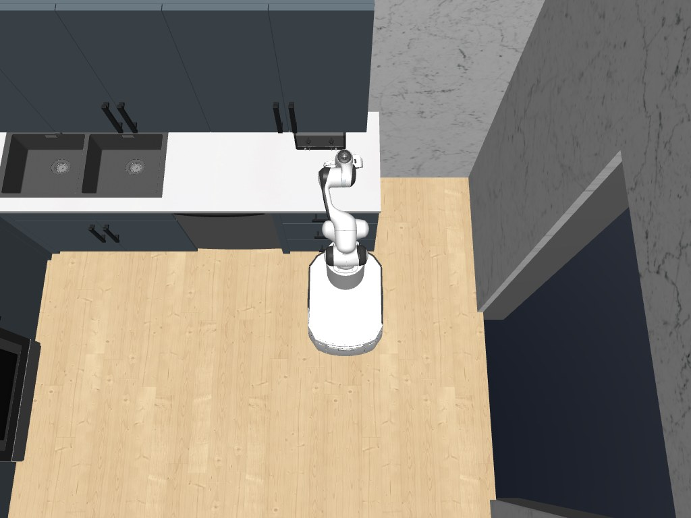
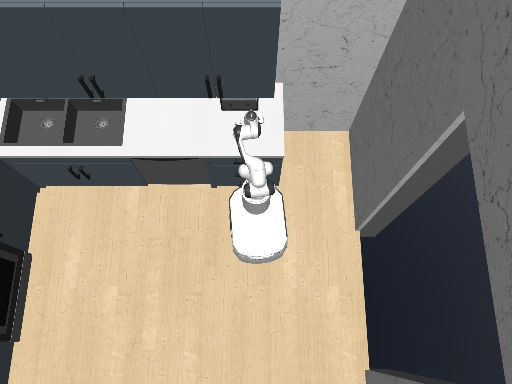
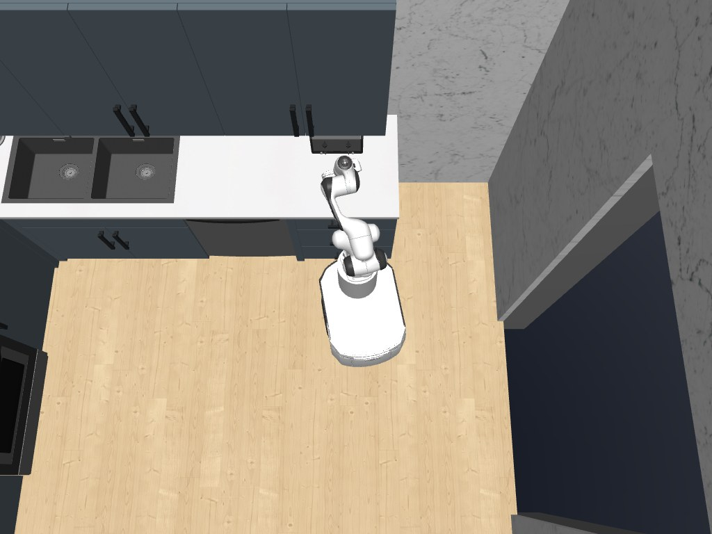
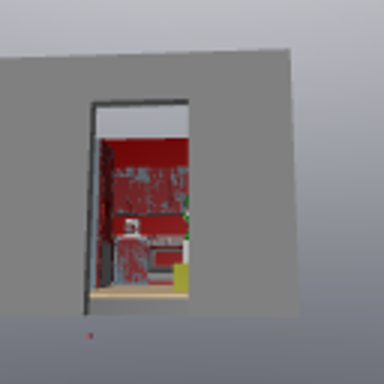

---
language:
- en
license: other
pipeline_tag: robotics
tags:
- OpenRAL
- rskill
- internvla_n1
- vision-language-action
- nf4
- 4-bit
- mobile_base
inference: false
---

# rskill-internvla_n1-mobile_base-vln-nf4

> **OpenRAL rSkill** — InternVLA-N1 / DualVLN vision-language **navigation**
> foundation model on any mobile base, NF4-quantized to fit an 8 GB GPU.
> Wraps `hf://InternRobotics/InternVLA-N1-DualVLN`; ships no weights.

This package wraps the upstream checkpoint with a `rskill.yaml` manifest that
adds capability checking, license surfacing, latency budgets, and local
registry integration. It does **not** copy model weights.

## Preview

Third-person capture of a real `openral deploy sim` closed-loop run in the
RoboCasa `NavigateKitchen` scene, instruction *"navigate through the kitchen to
reach the sink"*: the skill is dispatched via `/openral/execute_rskill`, the NF4
model runs inference in the deploy loop reading the forward **head** camera, and
`SimAttachedHAL` drives the panda_mobile base from the emitted `BODY_TWIST`
commands. The base spawns by an appliance and navigates across the kitchen to
the sink counter.

| Start | Middle | End |
| :---: | :---: | :---: |
|  |  |  |

Full third-person clip: [media/demo.mp4](media/demo.mp4).

**Model's-eye view.** The forward `head` camera the policy actually consumes —
a MuJoCo free camera ahead of the mobile base looking down its travel direction
(synthesized by the robocasa sim backend; on real hardware it is the robot's
forward nav camera). This is the egocentric RGB the System-2 grounder sees, not
the arm-mounted manipulation cameras:



Full head-camera clip: [media/head_camera_view.mp4](media/head_camera_view.mp4).

## What this skill does

Drives a mobile base to follow a natural-language navigation instruction
("go to the kitchen and stop at the fridge") from an egocentric RGB-D camera.
It emits a stream of base **body-twist** velocity commands and raises STOP on
arrival. Navigation verbs / spatial targets it is offered for in the reasoner
palette are in the manifest's `actions:` / `objects:` / `scenes:` keys.

## Upstream model, architecture & training

InternVLA-N1 (a.k.a. DualVLN), InternRobotics — arXiv:2512.08186,
"Ground Slow, Move Fast: A Dual-System Foundation Model for Generalizable
Vision-and-Language Navigation". A **dual-system** design:

- **System-2** (Qwen2.5-VL-7B) — "grounds slowly": from the RGB history +
  instruction it predicts the next **pixel goal** (a waypoint in the current
  image) or a discrete VLN-CE action (`forward` / `turn-left` / `turn-right` /
  `stop`).
- **System-1** (NavDP diffusion transformer) — "moves fast": back-projects the
  pixel goal into a **metric trajectory** using the depth image + camera
  intrinsics, which the adapter converts to a base velocity.

The two systems run **asynchronously** — System-1 keeps the base moving between
System-2 replans, giving smooth motion and dynamic obstacle avoidance. Trained
in simulation only (`InternData-N1`, 3k+ scenes, 830k VLN samples) yet
generalizes zero-shot to real Unitree Go2 / H1.

It is the highest-scoring VLN policy with **publicly released weights** as of
2026-07 (R2R val-unseen SR 64.3). Qwen-RobotNav (~64) and CorrectNav (65.1)
score comparably or higher but release no weights.

## Supported robots / embodiments

Embodiment-agnostic: `embodiment_tags: [mobile_base]` — any robot with a
planar base advertising the `body_twist` control mode. Validated in-tree
against `panda_mobile` in the RoboCasa `NavigateKitchen` scene
(`scenes/deploy/robocasa_navigate.yaml`). The paper deploys the same weights
on Unitree Go2 / H1 / Booster T1 with per-robot locomotion policies downstream.

## Sensors / observation contract

| Input | Key | Notes |
| --- | --- | --- |
| RGB | `observation.images.head` | forward egocentric nav view, ≥ 224×224, resized to 384² |
| Instruction | task string | natural-language navigation goal |

The `head` camera is a **forward-facing egocentric** view down the base's
travel direction — not an arm-mounted manipulation camera. On `panda_mobile`
in RoboCasa it is synthesized by the sim backend as a MuJoCo free camera just
ahead of the mobile base — `openral deploy sim` sets the backend's
`OPENRAL_ROBOCASA_HEAD_CAM=1` opt-in automatically whenever this skill is in
the capability-matched palette, so no manual export is needed; on real hardware it
is the robot's forward nav camera. The arm-workspace cameras
(`agentview` / `eye_in_hand`) are useless for VLN and are not consumed.

**Output:** one 6-D `BODY_TWIST` action `[vx, vy, vz, wx, wy, wz]` per step in
`base_link` (only forward `vx` + yaw `wz` are non-zero for a planar base).

### Depth: derived from DA3, not a robot sensor

The robot only needs **one forward RGB camera**. Metric depth is produced
monocularly by the **DA3 sidecar** (`depth-anything/DA3-SMALL`) — the same model
OpenRAL's SLAM/nvblox stack already runs — from the same RGB frame the policy
sees. So depth works **identically in sim and on real hardware** (no MuJoCo
depth render, no physical depth camera). The adapter reuses a running DA3
sidecar (SLAM's) via a ping when present, else auto-spawns its own (~0.27 GB,
~27 Hz on an 8 GB card).

> **DualVLN doesn't actually use depth.** This checkpoint's System-1 is
> `nextdit_async` — RGB + System-2-latent conditioned; its trajectory head never
> reads the depth tensor (verified against the InternNav model source). So depth
> is inert here and you can set `OPENRAL_INTERNVLA_N1_DEPTH=none` to skip DA3
> entirely (a unit-metre placeholder is sent, which the model ignores). DA3 is
> wired as the default so the `internvla_n1` family stays correct for a
> depth-consuming `navdp`-System-1 checkpoint.

## Runtime / manifest summary

- `model_family: internvla_n1`, `runtime: pytorch`, `quantization: int4` (NF4).
- **Out-of-process:** upstream InternNav pins `transformers==4.51.0`, so the
  model runs in an auto-provisioned py3.11 ZMQ **sidecar**
  (`tools/internvla_n1_sidecar.py` → `tools/_internvla_n1_server.py`); the
  `openral_sim.policies.internvla_n1` adapter is the client. First boot clones
  InternNav and builds the venv (several minutes); the 8.3B checkpoint is
  cached under `~/.cache/huggingface`.
- **VRAM:** NF4 backbone (~5 GB) + bf16 NavDP head (~0.6 GB) ≈ 7 GB peak; fits
  an 8 GB card alongside the sim render context. Full bf16 (~16.6 GB) needs
  ≥ 24 GB — override `quantization: none` there.
- `latency_budget.per_chunk_ms: 2500` (worst-case System-2 replan on NF4).

Run in the RoboCasa navigation scene:

```
just sync --all-packages --group robocasa --group rldx
OPENRAL_ALLOW_NONCOMMERCIAL=1 \
  openral deploy sim --config scenes/deploy/robocasa_navigate.yaml
```

## Verification status

- **Real-hardware inference: PASSED.** On an 8 GB RTX 4070, the NF4 8.3B model
  loads in ~26 s at **6.02 GB VRAM**; a real RGB frame + navigation instruction
  runs through both System-2 (Qwen2.5-VL-7B) and System-1 (NextDiT) and the
  adapter returns a finite 6-D `BODY_TWIST` (a 15°/s turn on the test frame).
  The sidecar auto-provisions its py3.11 venv; loading the released DualVLN
  checkpoint required pinning **`diffusers==0.32.2`** (0.33.1's `LuminaFeedForward`
  dropped the SwiGLU 2/3 inner-dim reduction the checkpoint's NextDiT was trained
  with) — an upstream repo↔checkpoint drift, handled in the boot helper.
- Schema / adapter / manifest / DA3 wiring / robot-compat / dispatch chain:
  validated (unit tests + `check_compatibility` against `panda_mobile`; full unit
  suite green; mypy + ruff clean).
- **Closed-loop base actuation in `robocasa/NavigateKitchen`: PASSED.** Via
  `openral deploy sim`, the skill dispatched through `/openral/execute_rskill`,
  the NF4 model ran inference in the deploy loop (16 chunks), emitted 6-D
  `BODY_TWIST` (`control_mode=7`, yaw 15°/s) on `/openral/candidate_action`, and
  `SimAttachedHAL` drove the panda_mobile base (odom moved ~33 mm + rotated ~9°);
  goal `success: true`. On an 8 GB card render robocasa on CPU
  (`MUJOCO_GL=osmesa`) so the whole GPU is the sidecar's — co-hosting the 6 GB
  sidecar with a GPU render OOMs the Qwen2.5-VL-7B generate peak.
- `deploy run` on physical hardware: requires a real mobile base + one RGB
  camera (DA3 supplies depth); verified to the HAL boundary.

## Benchmarks / provenance

Paper VLN-CE R2R val-unseen: SR **0.643**, SPL 0.57 (`eval/vln_ce_r2r.json`,
`reproduced_locally: false`). VLN-CE needs the Habitat simulator, which is not
an in-tree sim backend, so these are cited, not reproduced.

## License

- **Code** (this manifest, the adapter, the sidecar): Apache-2.0, as the rest
  of `openral/openral`.
- **Upstream inference code** (InternNav): MIT.
- **Weights** (`InternVLA-N1-DualVLN`): **CC-BY-NC-SA-4.0 — non-commercial.**
  The loader fails closed unless `OPENRAL_ALLOW_NONCOMMERCIAL=1` is set. This is
  weight-license compliance for a model OpenRAL does not own; it does not affect
  OpenRAL's Apache-2.0 code lineage.
