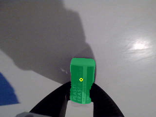
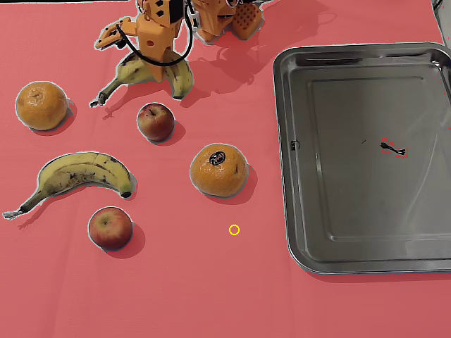

---
language:
- en
license: apache-2.0
pipeline_tag: mask-generation
tags:
- OpenRAL
- rskill
- segmenter
- mask-generation
- promptable-segmentation
- any
- sam2
- attachment-evidence
- grasped-object
inference: false
base_model:
- facebook/sam2.1-hiera-small
---

# rskill-sam2_1-any-grasped_object_mask-bf16

> **OpenRAL rSkill** — SAM 2.1 (Hiera-small) packaged as an Apache-2.0
> **promptable segmenter** (`kind: segmenter`). It answers one geometric
> question — "which pixels of this wrist frame belong to the object in the
> jaws?" — so the HAL's vision attachment-evidence producer can bound a grasped
> payload from real depth instead of simulator ground truth. One shot per
> attach / detach / regrasp event. **No actuators.**

This package wraps `hf://facebook/sam2.1-hiera-small` with a `rskill.yaml`
manifest that adds capability checking, license surfacing, latency budgets, and
local registry integration. It does **not** copy model weights.

## Preview

Real model output on two real in-tree frames (not synthetic), rendered by the
same CPU inference path the tests run. Yellow ring = the point prompt; tint =
the model's own best-scoring mask.

| Wrist view — good case | Third-person view — the failure case |
| :---: | :---: |
|  |  |
| score **0.842**, 5.4% of frame — isolates the eraser, excludes the jaws | score **0.978**, 59.8% of frame — the entire tablecloth |

The right-hand frame is why nothing downstream is allowed to trust the model's
confidence. See [Quality probe](#quality-probe--and-the-result-that-drives-the-safety-design).

## What this skill does

Given a camera frame and a **point** in it, returns the binary mask of whatever
object that point lands on. There is no label vocabulary and no class: the skill
never says *what* the pixels are, only *which* pixels belong to the prompted
thing.

Its consumer is the HAL's vision attachment-evidence producer. At a grasp event
the producer projects the tool center point into the wrist camera, asks this
skill for the mask, intersects the mask with the same frame's depth channel, and
fits the ≤16 bounded primitives of an `AttachedCollisionObject` so the safety
kernel plans around the carried payload. It replaces MuJoCo introspection, which
gives perfect answers in simulation and does not exist on real hardware.

| Field | Value |
| --- | --- |
| Actions | `detect` |
| Objects | grasped object (whatever is in the jaws — no vocabulary) |
| Scenes  | tabletop, kitchen, indoor, household |
| Embodiment | embodiment-agnostic (any wrist RGB camera ≥ 320×240) |

## How it works

SAM 2.1 is a first-class `transformers` architecture (`Sam2Model` +
`Sam2Processor`), so it runs **in-process** via the
[`Sam2Segmenter`](../../python/runner/src/openral_runner/backends/gstreamer/sam2_segmenter.py)
backend (`engine: sam2_hf`) — no sidecar venv, no ZMQ, no quantization beyond
the bf16 compute dtype. The HAL stays torch-free and reaches it over the
`openral_msgs/srv/SegmentInView` service.

The prompt crosses that service boundary as a **3-D point**, not a pixel, so
camera intrinsics stay entirely on the perception side. The mask comes back as a
raw `mono8` `sensor_msgs/Image` — see the `.srv` header for why raw and not
run-length encoded.

`multimask: true` returns SAM 2's three nested hypotheses (subpart / part /
whole). The backend orders them by **area ascending** and the consumer picks
between them on geometry.

### Observation → mask contract

| Direction | Key | Shape | Notes |
| --- | --- | --- | --- |
| in | wrist RGB camera | `(H, W, 3)` BGR `uint8` | latest frame; min 320×240 |
| in | prompt point(s) | `(u, v)` pixels | positive at the TCP; optional negatives at the jaw tips |
| out | masks | ≤3 × `(H, W)` bool | at the source frame's own resolution, area ascending |
| out | `mask_score_advisory` | float | recorded in the trace, **never** thresholded |

## Measured numbers

Measured on an **RTX 4070 Laptop 8 GB** (transformers 5.5.4, torch 2.9.1+cu128,
bf16, 512² input, ~3.5 GiB already resident from a co-loaded VLA), by
`torch.cuda.max_memory_allocated` deltas against a pre-load baseline:

| Metric | SAM 2.1 hiera-small | (SAM 3, for comparison) |
| --- | --- | --- |
| Weights | **74 MiB** | 1645 MiB |
| Peak allocated | **297 MiB** | 2037 MiB |
| Torch reserved | 448 MiB | 2262 MiB |
| Warm median | **53 ms** | 418 ms |
| First call (cold) | 742 ms | 970 ms |

Latency is **flat across input resolution** (46–52 ms from 224² to 1024²)
because `Sam2Processor` always resizes to 1024² internally. Wrist camera
resolution is not a lever for this model.

At 297 MiB the segmenter co-resides trivially with a ~3.5 GiB VLA and a
simulator on an 8 GB card, so it is held resident and warmed at node activate
rather than loaded on demand — the 742 ms first call would not fit inside the
HAL's ~100 ms deferred-ack barrier, but the 53 ms warm call fits with room to
spare.

### Quality probe — and the result that drives the safety design

Two real in-tree frames, prompted with a point at `(0.52·W, 0.68·H)` (a stand-in
for the projected TCP):

| Frame | Best-candidate IoU score | Mask coverage | Verdict |
| --- | --- | --- | --- |
| SO-101 wrist, holding an eraser (320×240) | 0.842 | 5.4% of frame | cleanly isolates the eraser, **excludes the jaws** |
| SO-101 third-person, fruit scene (640×480) | **0.978** | **59.8% of frame** | essentially the entire tablecloth |

The second row is the load-bearing finding for this whole package. A mis-aimed
or out-of-context point prompt returned a mask covering most of the image at the
model's **highest** confidence. The model's own score cannot detect that it is
wrong.

**Therefore every fail-closed gate in the consumer is geometric** — containment
between the jaws, a payload extent cap, a depth-validity fraction — and **never**
the mask score. `mask_score_advisory` is named to say so. Both frames are
regression-tested in `tests/unit/test_vision_attachment_evidence.py`.

## Upstream model and training

A thin wrapper around the upstream Apache-2.0 SAM 2.1 checkpoint; weights live
upstream and are not copied here.

| Field | Value |
| --- | --- |
| Source repo | [`facebook/sam2.1-hiera-small`](https://huggingface.co/facebook/sam2.1-hiera-small) |
| Base model  | SAM 2.1, Hiera-small backbone |
| Paper       | [arxiv:2408.00714](https://arxiv.org/abs/2408.00714) — *SAM 2: Segment Anything in Images and Videos* |
| License     | apache-2.0 (commercial use permitted) |
| Parameters  | ~46 M |
| Training data | upstream: SA-V and the SAM 2 training mixture per the Meta release |

The checkpoint's config declares `sam2_video`; loading it into the image-only
`Sam2Model` is the supported subset path and emits a `transformers` notice to
that effect. The image path is all this rSkill uses — there is no video/tracker
state, because segmentation is one-shot at an event, not a per-frame track.

## Supported robots

Embodiment-agnostic — the only requirement is a wrist RGB camera. The consumer
additionally needs registered depth on the same frame, but that is the HAL
producer's requirement, not this model's.

| Robot | Embodiment tag | Status | Notes |
| --- | --- | --- | --- |
| any with a wrist RGB-D camera | `any` | ⚡ experimental | validated against SO-101 wrist frames |

## Sensors required

Mirrors `rskill.yaml::sensors_required`.

| Key | Modality | Min resolution | Format |
| --- | --- | --- | --- |
| wrist RGB camera | RGB | 320 × 240 | `uint8` BGR frame |

## Manifest summary

| Field | Value |
| --- | --- |
| `name` | `OpenRAL/rskill-sam2_1-any-grasped_object_mask-bf16` |
| `version` | `0.1.0` |
| `license` | `apache-2.0` |
| `role` / `kind` | `s1` / `segmenter` |
| `runtime` / `quantization.dtype` | `pytorch` / `bf16` |
| `segmenter.engine` | `sam2_hf` |
| `segmenter.multimask` / `max_prompt_points` / `min_mask_area_px` | `true` / `8` / `64` |
| `weights_uri` | `hf://facebook/sam2.1-hiera-small` |
| `latency_budget.per_chunk_ms` | 100 ms (measured warm: 53 ms) |
| `commercial_use_allowed` | yes (Apache-2.0 weights) |

Full schema: [`openral_core.schemas.RSkillManifest`](../../python/core/src/openral_core/schemas.py).

## Quick start

```bash
just sync --group sam2   # torch + transformers + pillow for the in-process backend
```

```python
from openral_core.schemas import RSkillManifest, SegmenterEngine

manifest = RSkillManifest.from_yaml(
    "rskills/rskill-sam2_1-any-grasped_object_mask-bf16/rskill.yaml"
)
assert manifest.segmenter.engine is SegmenterEngine.SAM2_HF
```

## Reproduction

Packaging-only wrapper — no trained numbers to reproduce. The measured latency
and VRAM figures above need the reference GPU; the quality probe and the
geometric-gate regressions run on CPU:

```bash
just sync --group sam2
uv run pytest tests/unit/test_sam2_segmenter.py tests/unit/test_vision_attachment_evidence.py
```

## Evaluation

No benchmarks shipped — packaging-only wrapper; a promptable segmenter has no
task success rate. The quality probe above is the honest substitute.

## Known limitations

Inherited from the design and **not** fixed by this skill:

- **Articulated objects.** Vision gives geometry, not kinematic class. A drawer
  handle would mask as a free box. The consumer is scoped to free objects.
- **Transparent / thin objects.** Expected to fail the consumer's
  depth-validity gate and degrade to the conservative fallback box.
- **Self-occlusion.** The far side of the object is never observed; only
  partially mitigated by the consumer's view-ray inflation margin.
- **Mass / centre of mass / inertia.** Not estimable from vision; they stay
  `None` on real hardware, unlike the simulator producer.
- **Deformable objects and multi-object grasps.** Not addressed — a single
  positive point means a single object.
- **Support contact.** This skill establishes what is *attached*, never what is
  *resting on* something.

## License

This rSkill package (`rskill.yaml`, `README.md`) is **apache-2.0**. The wrapped
weights at `hf://facebook/sam2.1-hiera-small` are also **apache-2.0**, so the
segmenter is fully commercial-safe (CLAUDE.md §1.9).

## See also

- [`packages/msgs/srv/SegmentInView.srv`](../../packages/msgs/srv/SegmentInView.srv)
  — the typed HAL↔segmenter boundary, with the mono8-vs-RLE rationale.
- [`python/hal/src/openral_hal/_vision_attachment_evidence.py`](../../python/hal/src/openral_hal/_vision_attachment_evidence.py)
  — the consumer: geometric gates, primitive fit, and the conservative fallback.
- [`python/hal/src/openral_hal/_sim_attachment_evidence.py`](../../python/hal/src/openral_hal/_sim_attachment_evidence.py)
  — the simulator counterpart this transfers to real hardware, emitting the
  identical `AttachedCollisionObject` contract.
- [`rskills/omdet-turbo-locator/`](../omdet-turbo-locator/) — the *semantic*
  perception sibling ("find object X"), for contrast.
- [CLAUDE.md §6.4](../../CLAUDE.md) — rSkill packaging contract.
