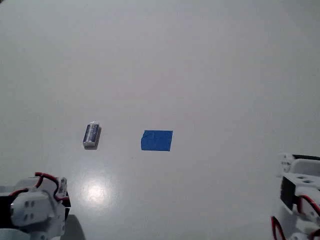
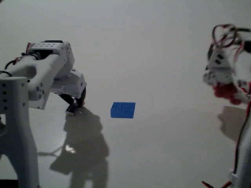
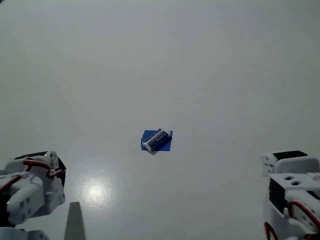
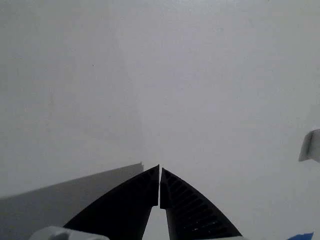
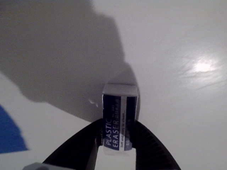
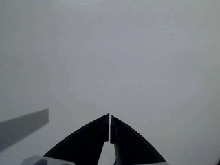

---
language:
- en
license: apache-2.0
library_name: lerobot
pipeline_tag: robotics
tags:
- OpenRAL
- rskill
- smolvla
- lerobot
- vision-language-action
- so101_follower
base_model:
- makermods/smolvla_makermods_eraser_place_unblurry_real_2026-07-31_17-35-54
base_model_relation: finetune
datasets:
- makermods/eraser_place_unblurry_real
inference: false
---

# rskill-smolvla-so101-eraser_place-bf16

> **OpenRAL rSkill** — [SmolVLA](https://arxiv.org/abs/2506.01844) finetuned to
> **place an eraser on a blue square** with a **real SO-101 follower arm**,
> packaged for `openral deploy run`.

This package ships an OpenRAL **mirror** of
[`makermods/smolvla_makermods_eraser_place_unblurry_real_2026-07-31_17-35-54`](https://huggingface.co/makermods/smolvla_makermods_eraser_place_unblurry_real_2026-07-31_17-35-54)
(Apache-2.0) — byte-identical weights, pinned to a commit SHA — plus an
`rskill.yaml` manifest that adds capability checking, license surfacing, the
camera-slot aliasing, the joint-units contract, a training-derived home pose,
latency budgets, and local registry integration.

## Preview

Frames from episode 0 of the training dataset — the fixed `front` view the
checkpoint conditions on. The eraser starts beside the blue square and ends on
top of it.

| Start | Middle | End |
| :---: | :---: | :---: |
|  |  |  |

The arm-mounted `wrist` view over the same three moments:

| Start | Middle | End |
| :---: | :---: | :---: |
|  |  |  |

## What this skill does

Picks up an eraser from a tabletop and places it on a blue square marked on the
same surface, on a real SO-101 follower arm. Single-task policy: it was trained
on exactly one instruction and has no other behaviour.

| Field | Value |
| --- | --- |
| Actions | `pick`, `place`, `pick_and_place` |
| Objects | `eraser` |
| Scenes | `tabletop` |
| Embodiment | `so101_follower` |

> **Prompt it verbatim.** The dataset carries exactly ONE task string —
> `"place the erase on the blue square"`, upstream typo included. The tokenizer
> saw only that string; paraphrasing ("place the eraser on the blue square")
> puts the language conditioning out of distribution.

## Quick start

```python
from openral_rskill.loader import rSkill

pkg = rSkill.from_yaml("rskills/rskill-smolvla-so101-eraser_place-bf16/rskill.yaml")
print(pkg.manifest.name, pkg.manifest.version)
```

```bash
# Does this skill fit your arm?
uv run openral rskill check rskills/rskill-smolvla-so101-eraser_place-bf16 \
    --robot robots/so101_follower/robot.yaml

# Real SO-101 deploy (weights are public Apache-2.0). The skill is discovered
# from the in-tree palette by embodiment match; the reasoner picks it from the
# `eraser` / `place` vocabulary in the manifest.
uv run openral deploy run --config scenes/deploy/so101_bench.yaml

# `deploy run` has no --initial-task (that flag is `deploy sim` only), so send
# the goal to the running graph — verbatim:
uv run openral prompt "place the erase on the blue square"
```

## How it works

SmolVLA (~0.45 B: a 16-layer SmolVLM2-500M vision-language backbone with a
frozen vision encoder, plus a flow-matching action expert at
`expert_width_multiplier 0.75`, 10 denoising steps). Two 640×480 RGB views and
the 6-D joint-position state go in; one 50-step chunk of absolute 6-D joint
targets comes out, replayed synchronously before the next inference.

### Observation → action contract

| Direction | Key | Shape | Notes |
| --- | --- | --- | --- |
| in | `observation.images.camera1` → `front` | `(1, 3, 480, 640) float32 [0,1]` | fixed front/overview camera |
| in | `observation.images.camera2` → `wrist` | `(1, 3, 480, 640) float32 [0,1]` | arm-mounted camera |
| in | `observation.state` | `(1, 6)` float32 | joint positions, **degrees** (lerobot SO-ARM scale) |
| in | `task` | str | `"place the erase on the blue square"` |
| out | action chunk | `(50, 6)` float32 | absolute joint positions, **degrees** |

Both views are internally letterboxed to 512×512 by the policy's own
`resize_imgs_with_padding`, so the manifest only requires ≥224×224.

### Camera aliasing — which view goes where

The runner first re-keys the robot's sensors onto the VLA slots using
`robots/so101_follower/robot.yaml`'s `vla_feature_key` (`top` → `camera1`,
`wrist` → `camera2`); the manifest's `image_preprocessing.aliases` then rename
those slots to this checkpoint's own input-feature keys.

| Robot sensor | VLA slot | Checkpoint key |
| --- | --- | --- |
| `top` | `observation.images.camera1` | `observation.images.front` |
| `wrist` | `observation.images.camera2` | `observation.images.wrist` |

**This mapping is load-bearing and was verified numerically**
(`tests/integration/test_smolvla_eraser_place_rskill.py`): replaying a real
training frame through the manifest wiring reproduces the recorded teleop chunk
to a per-joint MAE of **0.15 – 1.46** over all 50 steps (the flow-matching
sampler is stochastic, so this varies run to run; the test's ceiling is 5.0).
Swapping the two aliases on the same frame degrades it to **1.04 – 44.27**.

### Joint units — degrees

State and action are on the lerobot SO-ARM scale this repo models as
**degrees** (the normalizer stats span `observation.state` −102.9 … +101.1 and
`action` −103.8 … +103.4 — radians would be ±3.14). OpenRAL's `JointState` /
`Action` contract is radians, so the skill runner converts deg↔rad at the policy
boundary. The manifest declares `action_contract.joint_units: degrees`
explicitly rather than relying on the stats-magnitude heuristic — a wrong guess
here drives the arm into its joint limits.

### Home pose

`starting_pose` is a real **home** pose recovered from the training data, not
an SRDF default and not "wherever episode 0 began". The operator both starts
and returns to it — per-joint medians over all 25 episodes' first frames and
last frames agree to two decimals:

| | `shoulder_pan` | `shoulder_lift` | `elbow_flex` | `wrist_flex` | `wrist_roll` | `gripper` |
| --- | ---: | ---: | ---: | ---: | ---: | ---: |
| first-frame median | −7.21 | −102.68 | 95.12 | 56.70 | 6.15 | 1.95 |
| last-frame median | −7.21 | −102.68 | 94.59 | 56.70 | 6.15 | 1.95 |

(lerobot units.) The **median** is used rather than the mean: `wrist_flex` has a
few long-start outliers reaching 74.46 that drag the mean to 59.02, while the
median sits at 56.70 — and the last-frame median independently agrees.
`shoulder_lift` has std 0.09, i.e. a hard mechanical home stop.

**Units are mixed**, per the OpenRAL joint-channel contract:

- the five arm joints convert degrees → radians;
- the checkpoint's **gripper channel is lerobot `[0, 100]`, not an angle**,
  while OpenRAL's HAL surface is normalized `[0, 1]`. The manifest's
  `policy_extras.gripper_scale: 100` converts both directions at the policy
  boundary. `SO100FollowerHAL._obs_to_positions` and `MujocoArmHAL`'s
  `AFFINE_LOW_HIGH` read mode expose the same `[0, 1]` public surface. So
  lerobot 1.95 → `0.0195` (jaws essentially closed), **not**
  `radians(1.95) = 0.034`, which would command a slightly open jaw.

Two arm channels are clamped to the SO-101 manifest limits (see below); both
clamps are ≤ 5° and stay inside the observed home spread, so the first VLA tick
still sees an in-distribution pose.

```yaml
starting_pose: [-0.1258, -1.7453, 1.5708, 0.9897, 0.1074, 0.0195]
```

### Known limitation — the training envelope overshoots the SO-101 limits

The teleop data reaches slightly past the SO-101 MJCF `new_calib` limits carried
by `robots/so101_follower/robot.yaml`:

| Joint | Training extreme | Robot limit |
| --- | --- | --- |
| `shoulder_lift` | −103.8° | −100.0° (−1.7453 rad) |
| `elbow_flex` | +97.0° | +90.0° (+1.5708 rad) |
| `wrist_flex` | +103.4° | +95.0° (+1.6581 rad) |

Those are the tails of a per-arm servo calibration, not a different kinematic
chain — but the safety kernel clamps or rejects anything past the manifest
limits, so expect clipping at the very top of the `elbow_flex` / `wrist_flex`
range. **Do not widen the robot manifest to accommodate this checkpoint:** the
limits are the mechanical contract, and loosening them is a safety-WG decision
with a hazard-log entry (CLAUDE.md §3 "Safety"), not a packaging change.

## How it was trained

| Field | Value |
| --- | --- |
| Weights repo | [`OpenRAL/rskill-smolvla-so101-eraser_place-bf16`](https://huggingface.co/OpenRAL/rskill-smolvla-so101-eraser_place-bf16) (mirror, pinned `@7a9a8a0`) |
| Source repo | [`makermods/smolvla_makermods_eraser_place_unblurry_real_2026-07-31_17-35-54`](https://huggingface.co/makermods/smolvla_makermods_eraser_place_unblurry_real_2026-07-31_17-35-54) |
| Base model | [`lerobot/smolvla_base`](https://huggingface.co/lerobot/smolvla_base) |
| Paper | [arXiv:2506.01844](https://arxiv.org/abs/2506.01844) — *SmolVLA* |
| License | Apache-2.0 (code + weights) |
| Parameters | 450.0 M (measured on load) |
| Training data | [`makermods/eraser_place_unblurry_real`](https://huggingface.co/datasets/makermods/eraser_place_unblurry_real) — 25 episodes, 10 534 frames @ 30 FPS, 1 task |
| Training | 20 000 steps, batch 32, AdamW lr 1e-4, cosine decay, seed 1000, lerobot 0.6.0 |
| Precision | fp32 at rest (1.2 GB `model.safetensors`); loaded bf16 |

### Why the weights are mirrored

`weights_uri` points at this repo, not at the upstream one, per the catalog
standard (`rskills/README.md` — *"One rSkill ⇄ one HF repo"*). The
`model.safetensors` here is **byte-identical** to upstream — sha256
`58d656e494a3143c00b19261a14f2b312656751cedd98253ab8a5f3fbcc73609`, checked
against the upstream LFS digest before upload — and the URI is pinned to a
commit SHA so loads are reproducible (CLAUDE.md §1.8).

This isn't ceremony. The sibling
[`rskill-smolvla-so101-pen-bf16`](../smolvla-so101-pen/) points at a
third-party repo that went **gated after packaging**; it now needs
`HF_HUB_OFFLINE=1` and a warm cache to deploy at all. Mirroring removes that
failure mode.

The mirror carries only the **7 root inference files**, not the 20
`checkpoints/<step>/` training snapshots (≈ 21 GB with optimizer state) that
the upstream repo also holds. Every OpenRAL fetch path here is a per-file
`hf_hub_download`, never a `snapshot_download`.

## Supported robots

| Robot | Embodiment tag | Status | Notes |
| --- | --- | --- | --- |
| SO-101 follower | `so101_follower` | ⚡ experimental | Checkpoint + dataset record lerobot 0.6.0's unified `so_follower` type, which does not distinguish SO-100 from SO-101; the arm was confirmed out-of-band to be an SO-101. Numerically verified against the training data; **not yet run on hardware from OpenRAL**. |

## Sensors required

| Key | Modality | Min resolution | Format |
| --- | --- | --- | --- |
| `observation.images.camera1` | RGB | 224 × 224 (trained 640 × 480) | `float32` |
| `observation.images.camera2` | RGB | 224 × 224 (trained 640 × 480) | `float32` |
| `observation.state` | proprioception | `(6,)` | `float32` |

## Manifest summary

| Field | Value |
| --- | --- |
| `name` | `OpenRAL/rskill-smolvla-so101-eraser_place-bf16` |
| `version` | `0.1.0` |
| `license` | `apache-2.0` |
| `role` / `kind` | `s1` / `vla` |
| `model_family` | `smolvla` |
| `embodiment_tags` | `so101_follower` |
| `runtime` / `quantization.dtype` | `pytorch` / `bf16` |
| `weights_uri` | `hf://OpenRAL/rskill-smolvla-so101-eraser_place-bf16@7a9a8a0` (pinned mirror) |
| `chunk_size` / `n_action_steps` | 50 / 50 |
| `action_contract` | 6-D `joint_positions`, `joint_units: degrees` |
| `latency_budget.per_chunk_ms` | 400 (**191 ms measured**, RTX 4070 Laptop) |
| `min_vram_gb.bf16` | 1.5 (**1.19 GiB peak measured**) |
| `reward_rskill_name` | `OpenRAL/rskill-robometer_4b-any-general-nf4` |
| `commercial_use_allowed` | `true` (Apache-2.0) |

Full schema: [`openral_core.schemas.RSkillManifest`](../../python/core/src/openral_core/schemas.py).

## Reproduction

```bash
just sync --group sim --group dataset --group opencv --inexact

# Replays a real training frame through the manifest's wiring and compares the
# emitted 50-step chunk against the recorded teleop actions.
uv run pytest tests/integration/test_smolvla_eraser_place_rskill.py -q
```

## Evaluation

No benchmarks shipped — there is no simulated twin of this scene, and OpenRAL
has not run the checkpoint on hardware. The upstream model card reports no
success rates either. The integration test above is a wiring / fidelity check
against the training distribution, **not** a task success rate.

## License

This rSkill package (`rskill.yaml`, `README.md`, `media/`) is **Apache-2.0**.
The mirrored weights in this repo are byte-identical to
`makermods/smolvla_makermods_eraser_place_unblurry_real_2026-07-31_17-35-54`
and remain **Apache-2.0** as published by the author, as is the training
dataset. Commercial use is allowed.

## See also

- [`robots/so101_follower/robot.yaml`](../../robots/so101_follower/) — RobotDescription manifest.
- [`scenes/deploy/so101_bench.yaml`](../../scenes/deploy/so101_bench.yaml) — paired real-hardware deploy scene.
- [`rskills/smolvla-so101-pen`](../smolvla-so101-pen/) / [`rskills/smolvla-so101-pick-place-pen`](../smolvla-so101-pick-place-pen/) — sibling SO-101 SmolVLA skills.
- [`docs/reference/vla_compatibility.md`](../../docs/reference/vla_compatibility.md) — VLA × Robot × Sim matrix.
- [CLAUDE.md §3](../../CLAUDE.md) — rSkill packaging contract.
